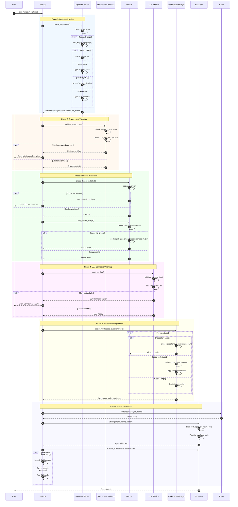

# Application Startup & Initialization

This diagram illustrates the complete startup sequence when a user initiates a Strix scan.

## Overview

The application startup involves:
1. CLI argument parsing and target type detection
2. Environment validation (Docker, LLM API keys)
3. Docker image availability check
4. LLM connection warmup
5. Workspace preparation and sandbox initialization

## Sequence Diagram



## Key Components

| Component | File Location | Responsibility |
|-----------|---------------|----------------|
| CLI Entry Point | `interface/main.py` | Orchestrates startup sequence |
| Argument Parser | `interface/main.py:parse_arguments()` | Parses CLI arguments and detects target types |
| Environment Validator | `interface/main.py:validate_environment()` | Validates required environment variables |
| Docker Manager | `interface/main.py:check_docker_installed()` | Manages Docker availability and images |
| LLM Warmup | `interface/main.py:warm_up_llm()` | Tests LLM connectivity |
| Workspace Manager | `utils/utils.py` | Prepares target workspaces |
| StrixAgent | `agents/StrixAgent/strix_agent.py` | Main security testing agent |
| Tracer | `telemetry/tracer.py` | Logging and reporting |

## Environment Variables

| Variable | Required | Description |
|----------|----------|-------------|
| `STRIX_LLM` | Yes | LLM model identifier (e.g., `gpt-4`, `claude-3`) |
| `LLM_API_KEY` | Yes | API key for the LLM provider |
| `PERPLEXITY_API_KEY` | No | Enables web search capability |
| `STRIX_IMAGE` | No | Custom sandbox Docker image |

## Target Type Detection Logic

```
Target Input → Type Detection:
├── Starts with "git@" or "github.com" → repository
├── Starts with "http://" or "https://" → web_application
├── Exists as local path → local_code
├── Matches IP regex → ip_address
└── Default → web_application (if contains domain pattern)
```
