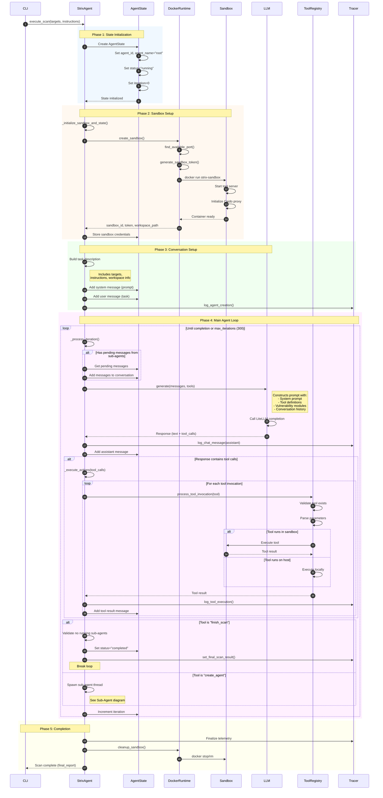
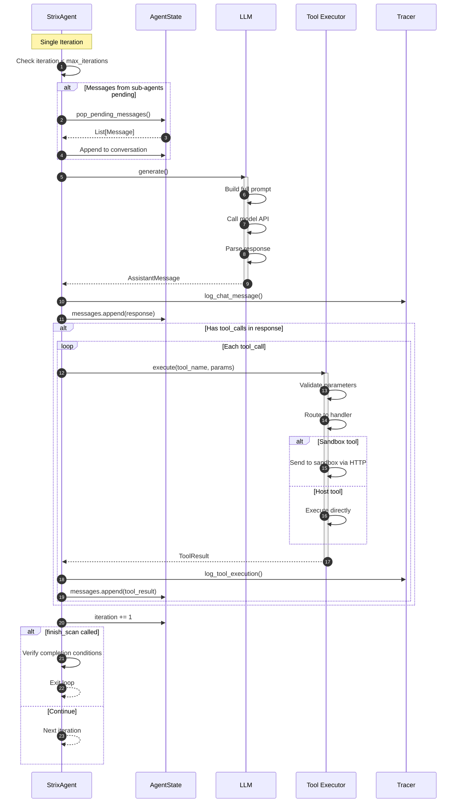

# Root Agent Scan Execution

This diagram illustrates the main execution loop of the Root Agent (StrixAgent) during a security scan.

## Overview

The root agent execution involves:
1. Sandbox initialization (Docker container creation)
2. Task construction and conversation initialization
3. Main agent loop with LLM interactions
4. Tool execution and result processing
5. Iteration management and completion

## Sequence Diagram



## Detailed Iteration Flow



## Key Components

| Component | File Location | Responsibility |
|-----------|---------------|----------------|
| StrixAgent | `agents/StrixAgent/strix_agent.py` | Root agent implementation |
| BaseAgent | `agents/base_agent.py` | Core agent loop and tool processing |
| AgentState | `agents/state.py` | Agent state management |
| DockerRuntime | `runtime/docker_runtime.py` | Sandbox container management |
| LLM | `llm/llm.py` | Model interaction layer |
| ToolRegistry | `tools/registry.py` | Tool registration and routing |
| Tracer | `telemetry/tracer.py` | Execution logging |

## Agent Loop Configuration

| Parameter | Default | Description |
|-----------|---------|-------------|
| `max_iterations` | 300 | Maximum loop iterations before forced stop |
| `llm_timeout` | 600s | Timeout for individual LLM calls |
| `tool_timeout` | 300s | Timeout for tool execution |

## State Transitions

```
Created → Running → Completed
              ↓
           Error
              ↓
          Waiting (for sub-agents)
              ↓
           Running
```
