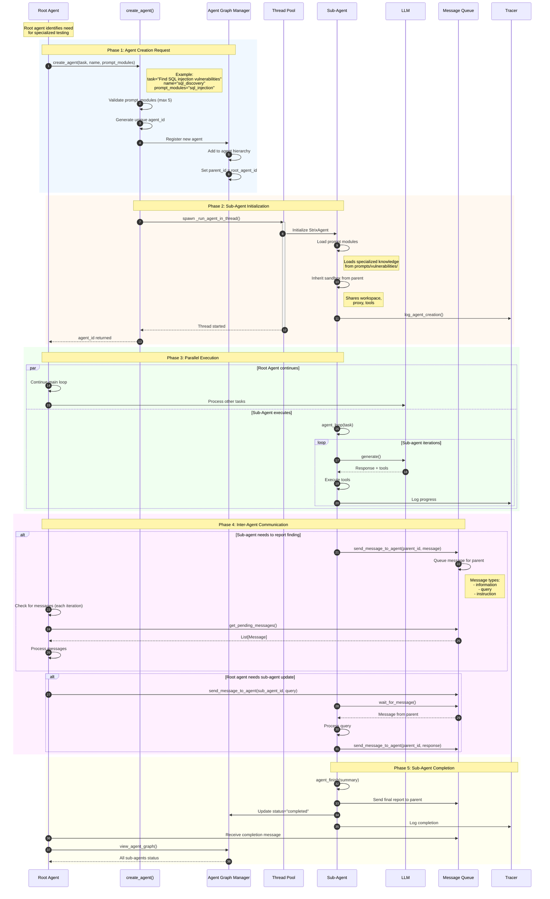
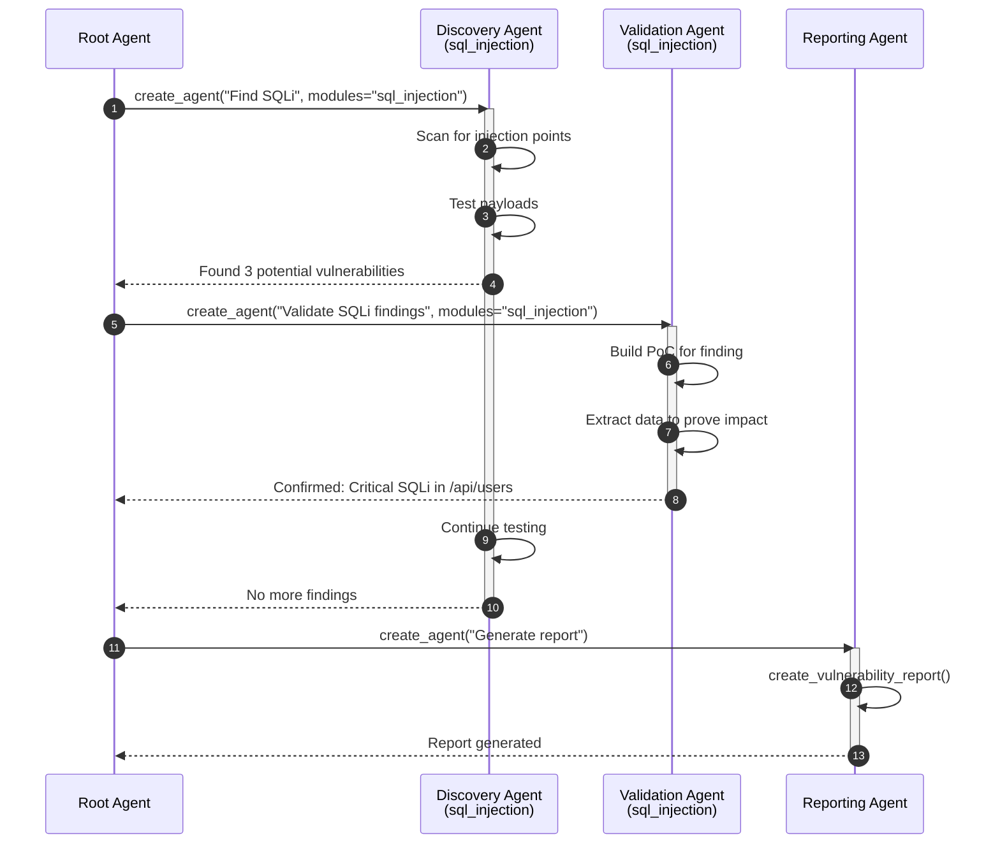
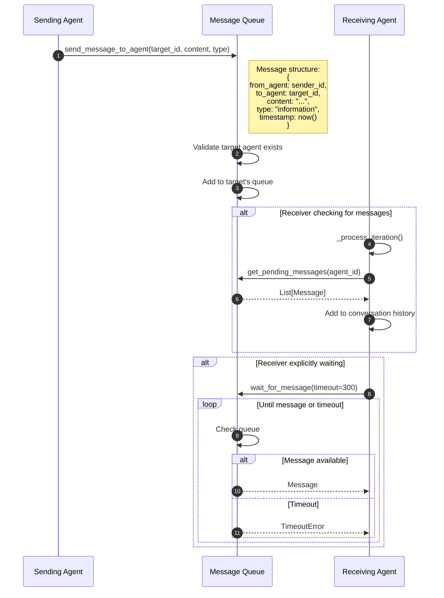

# Sub-Agent Creation & Coordination

This diagram illustrates how the root agent spawns specialized sub-agents and coordinates their execution.

## Overview

Sub-agent coordination involves:
1. Root agent identifying need for specialized testing
2. Creating sub-agents with specific prompt modules
3. Running sub-agents in separate threads
4. Inter-agent communication via message queue
5. Result aggregation and completion handling

## Sequence Diagram



## Agent Hierarchy Example



## Message Queue Detail



## Key Components

| Component | File Location | Responsibility |
|-----------|---------------|----------------|
| create_agent | `tools/agents_graph/actions.py` | Spawns new sub-agents |
| send_message_to_agent | `tools/agents_graph/actions.py` | Inter-agent messaging |
| wait_for_message | `tools/agents_graph/actions.py` | Blocking message wait |
| view_agent_graph | `tools/agents_graph/actions.py` | Visualize agent hierarchy |
| Agent Graph Manager | `tools/agents_graph/manager.py` | Tracks all agents |
| Message Queue | `tools/agents_graph/message_queue.py` | Message routing |

## Prompt Module Assignment

When creating a sub-agent, prompt modules determine its specialization:

| Module Type | Examples | Purpose |
|-------------|----------|---------|
| Vulnerability | `sql_injection`, `xss`, `idor` | Specific vulnerability testing |
| Framework | `fastapi`, `nextjs` | Framework-specific patterns |
| Protocol | `graphql` | Protocol testing |
| Technology | `firebase_firestore`, `supabase` | Tech-specific security |
| Coordination | `root_agent` | Orchestration (root only) |

## Sub-Agent Constraints

- **Max modules per agent**: 5 (for focus)
- **Sandbox sharing**: Sub-agents share parent's sandbox
- **Independent execution**: Run in separate threads
- **No direct tool sharing**: Communicate via messages
- **Completion requirement**: Must call `agent_finish()` to complete

## Agent Status Lifecycle

```
pending → running → completed
             ↓
          waiting (for child agents)
             ↓
          running
             ↓
          error (on exception)
```
