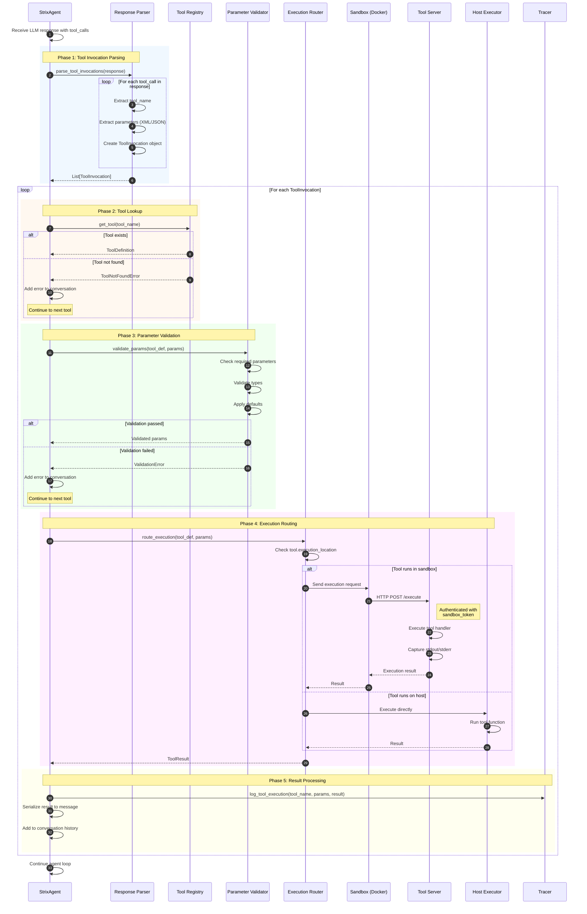
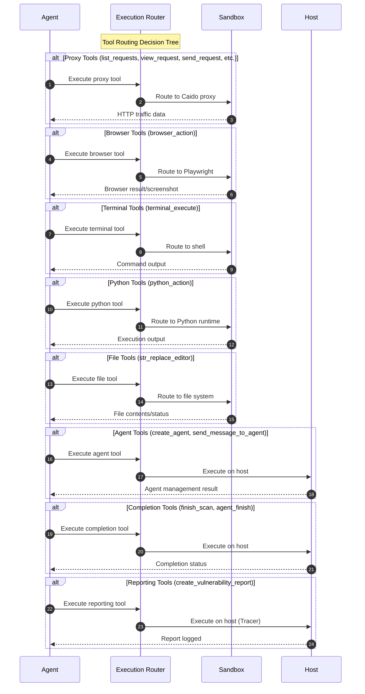
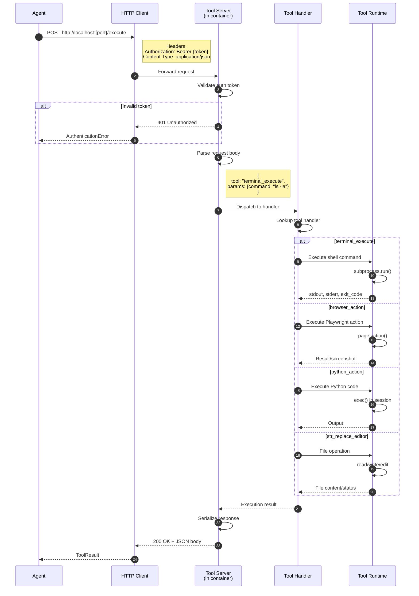
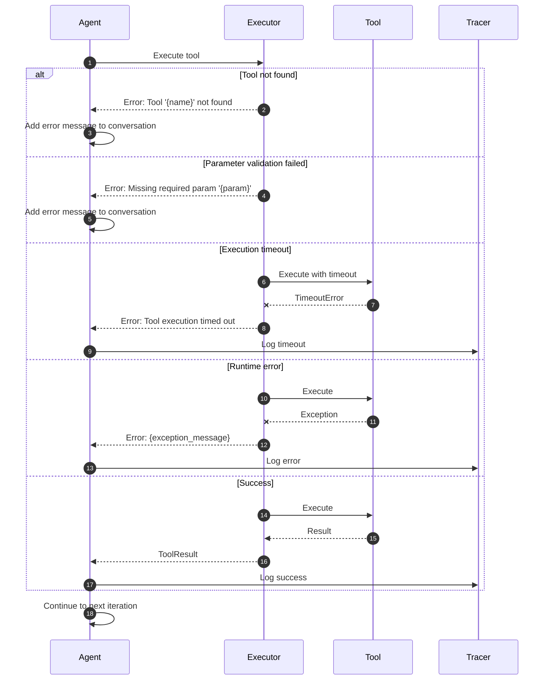

# Tool Execution Pipeline

This diagram illustrates how tools are invoked, validated, routed, and executed in the Strix architecture.

## Overview

The tool execution pipeline involves:
1. LLM response parsing for tool invocations
2. Tool registry lookup and validation
3. Parameter parsing and type conversion
4. Routing to sandbox or host execution
5. Result serialization and conversation update

## Sequence Diagram



## Tool Categories and Routing



## Sandbox Tool Execution Detail



## Key Components

| Component | File Location | Responsibility |
|-----------|---------------|----------------|
| Tool Registry | `tools/registry.py` | Tool registration and lookup |
| Tool Executor | `tools/executor.py` | Execution orchestration |
| Parameter Validator | `tools/validator.py` | Input validation |
| Tool Server | `runtime/tool_server.py` | Sandbox-side handler |
| Tool Handlers | `tools/*/actions.py` | Individual tool implementations |
| Tracer | `telemetry/tracer.py` | Execution logging |

## Available Tools (27 total)

| Category | Tools | Execution Location |
|----------|-------|-------------------|
| **Proxy** | `list_requests`, `view_request`, `send_request`, `repeat_request`, `scope_rules`, `list_sitemap`, `view_sitemap_entry` | Sandbox |
| **Browser** | `browser_action` | Sandbox |
| **Terminal** | `terminal_execute` | Sandbox |
| **Python** | `python_action` | Sandbox |
| **File Edit** | `str_replace_editor` | Sandbox |
| **Agents** | `create_agent`, `send_message_to_agent`, `wait_for_message`, `view_agent_graph` | Host |
| **Completion** | `agent_finish`, `finish_scan` | Host |
| **Reporting** | `create_vulnerability_report` | Host |
| **Analysis** | `think`, `web_search` | Host |
| **Notes** | `create_note`, `list_notes`, `update_note`, `delete_note` | Sandbox |

## Error Handling Flow



## Tool Result Format

```python
ToolResult:
    tool_name: str          # Name of executed tool
    success: bool           # Execution success status
    output: str             # Tool output (stdout or result)
    error: Optional[str]    # Error message if failed
    metadata: Dict          # Additional tool-specific data
```
