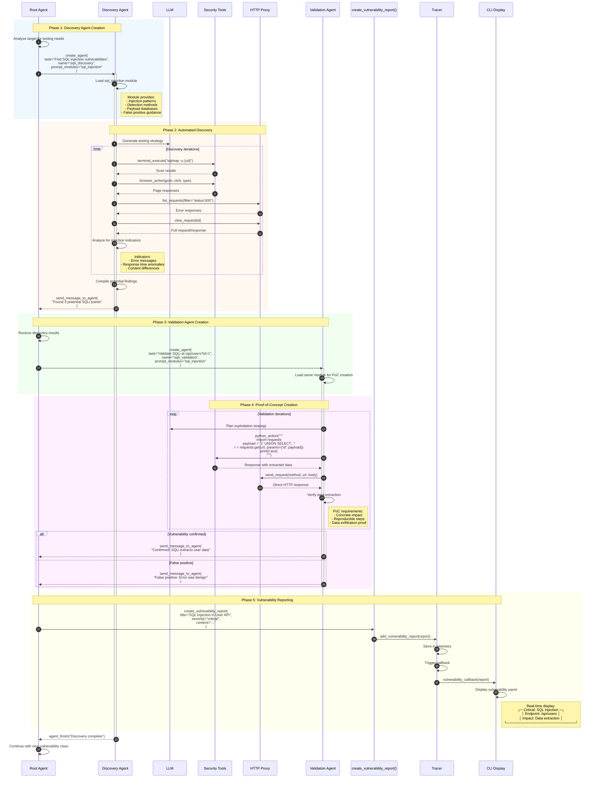
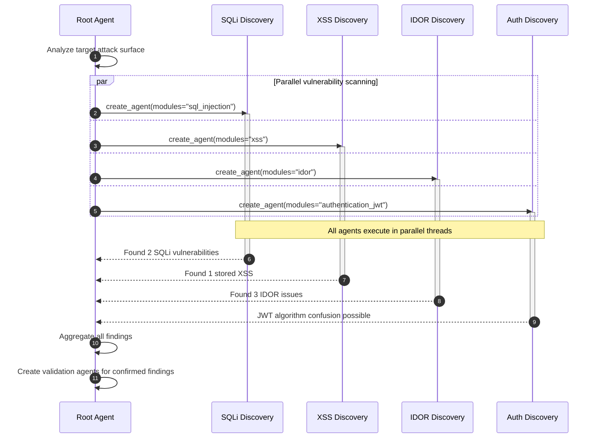
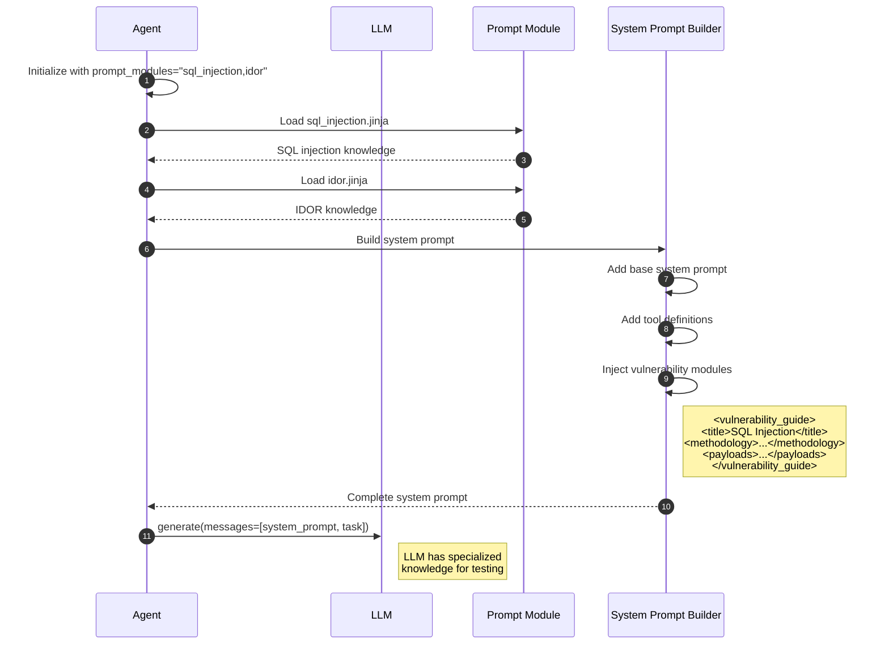
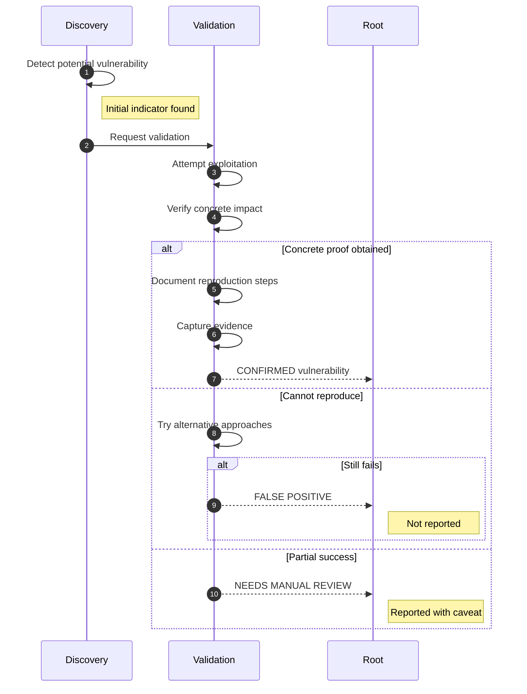

# Vulnerability Discovery & Reporting

This diagram illustrates the complete vulnerability discovery workflow from initial scanning through validation and reporting.

## Overview

Vulnerability discovery involves:
1. Root agent spawning specialized discovery agents
2. Discovery agents testing for specific vulnerability classes
3. Validation agents creating proof-of-concept exploits
4. Reporting agents documenting findings
5. Real-time vulnerability display to user

## Sequence Diagram



## Multi-Vulnerability Parallel Discovery



## Vulnerability Module Integration



## Key Components

| Component | File Location | Responsibility |
|-----------|---------------|----------------|
| Discovery Agent | `agents/StrixAgent/` | Specialized vulnerability scanning |
| Validation Agent | `agents/StrixAgent/` | PoC creation and verification |
| Vulnerability Modules | `prompts/vulnerabilities/` | Specialized testing knowledge |
| create_vulnerability_report | `tools/reporting/actions.py` | Report generation |
| Tracer | `telemetry/tracer.py` | Report storage and callbacks |
| CLI Renderer | `interface/tool_components/reporting_renderer.py` | Real-time display |

## Vulnerability Severity Levels

| Severity | Criteria | Examples |
|----------|----------|----------|
| **Critical** | Remote code execution, full data breach | SQLi with data extraction, RCE |
| **High** | Significant data exposure, privilege escalation | Stored XSS, IDOR on sensitive data |
| **Medium** | Limited data exposure, requires user interaction | Reflected XSS, CSRF |
| **Low** | Minor information disclosure | Verbose errors, version disclosure |
| **Info** | Observations, recommendations | Missing headers, outdated libraries |

## Vulnerability Report Structure

```python
VulnerabilityReport:
    title: str              # "SQL Injection in User API"
    severity: str           # "critical" | "high" | "medium" | "low" | "info"
    content: str            # Detailed description with PoC
    metadata:
        endpoint: str       # Affected endpoint
        method: str         # HTTP method
        parameter: str      # Vulnerable parameter
        payload: str        # Working payload
        impact: str         # Business impact description
        reproduction: str   # Steps to reproduce
        remediation: str    # Fix recommendations
```

## False Positive Prevention


