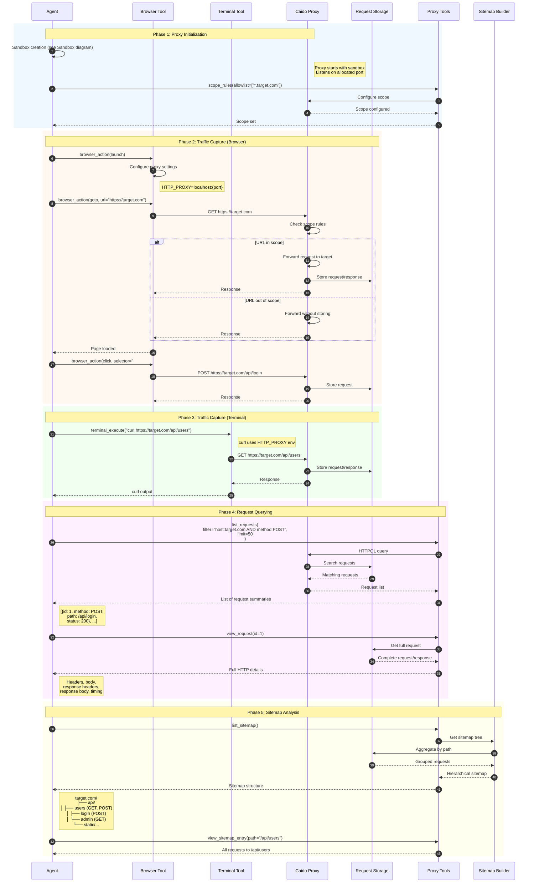
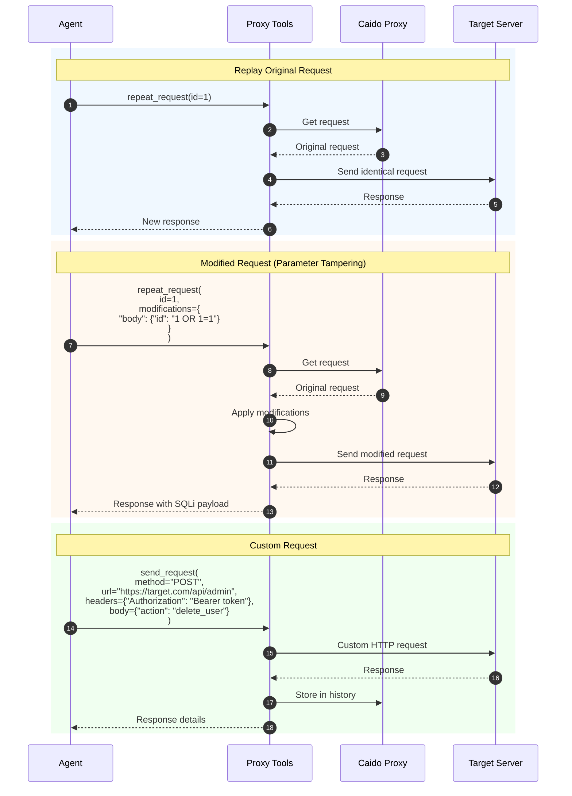
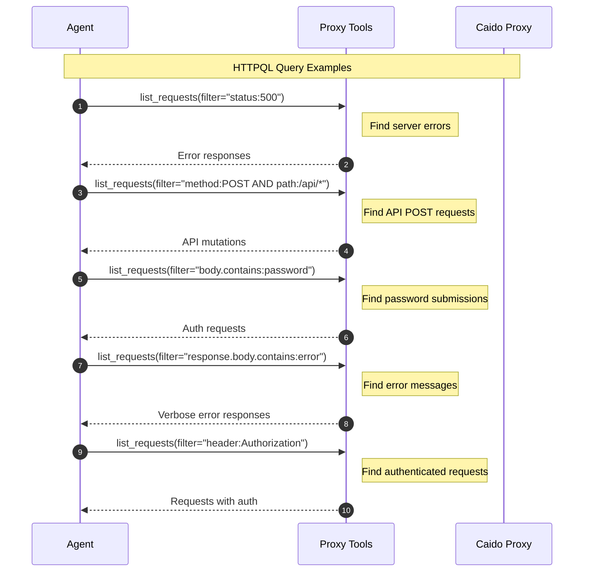
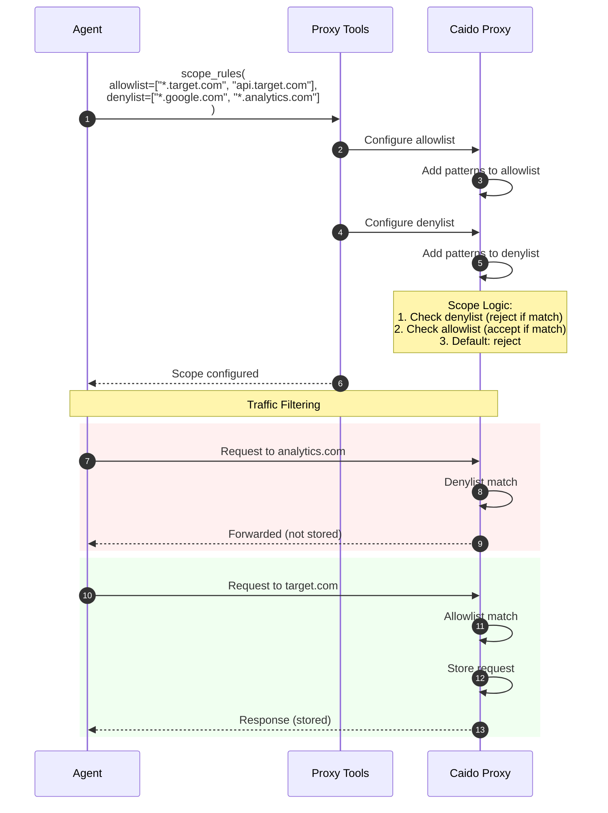

# HTTP Request Capture & Analysis

This diagram illustrates how HTTP traffic is captured, stored, and analyzed through the Caido proxy integration.

## Overview

HTTP request capture involves:
1. Caido proxy initialization in the sandbox
2. Browser/terminal traffic routing through proxy
3. Request interception and storage
4. HTTPQL query-based filtering
5. Request replay and modification

## Sequence Diagram



## Request Replay & Modification



## HTTPQL Filter Examples



## Scope Configuration



## Key Components

| Component | File Location | Responsibility |
|-----------|---------------|----------------|
| Proxy Manager | `tools/proxy/manager.py` | Caido proxy control |
| list_requests | `tools/proxy/actions.py` | Query captured requests |
| view_request | `tools/proxy/actions.py` | Get full request details |
| send_request | `tools/proxy/actions.py` | Custom HTTP requests |
| repeat_request | `tools/proxy/actions.py` | Replay with modifications |
| scope_rules | `tools/proxy/actions.py` | Configure capture scope |
| list_sitemap | `tools/proxy/actions.py` | Get hierarchical view |
| Caido Proxy | (in sandbox) | HTTP interception engine |

## Request Data Structure

```python
CapturedRequest:
    id: int                     # Unique request ID
    method: str                 # HTTP method
    url: str                    # Full URL
    path: str                   # URL path
    host: str                   # Target host
    headers: Dict[str, str]     # Request headers
    body: Optional[str]         # Request body
    timestamp: datetime         # Capture time

    response:
        status: int             # HTTP status code
        headers: Dict[str, str] # Response headers
        body: str               # Response body
        time_ms: int            # Response time
```

## Common Workflows

### 1. Endpoint Discovery
```
browser_action(goto) → list_sitemap() → Analyze attack surface
```

### 2. Parameter Testing
```
view_request(id) → repeat_request(modifications) → Analyze response
```

### 3. Error Analysis
```
list_requests(filter="status:500") → view_request(id) → Investigate
```

### 4. Authentication Flow Analysis
```
list_requests(filter="path:/auth/*") → view_request(id) → Extract tokens
```
