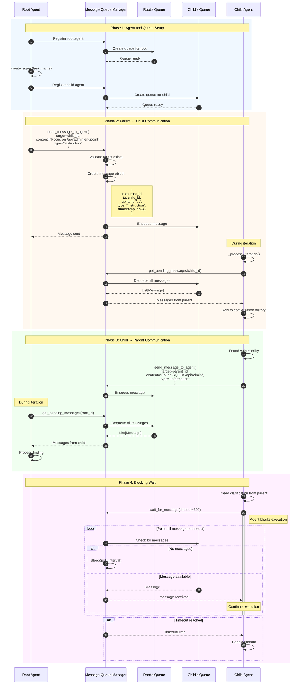
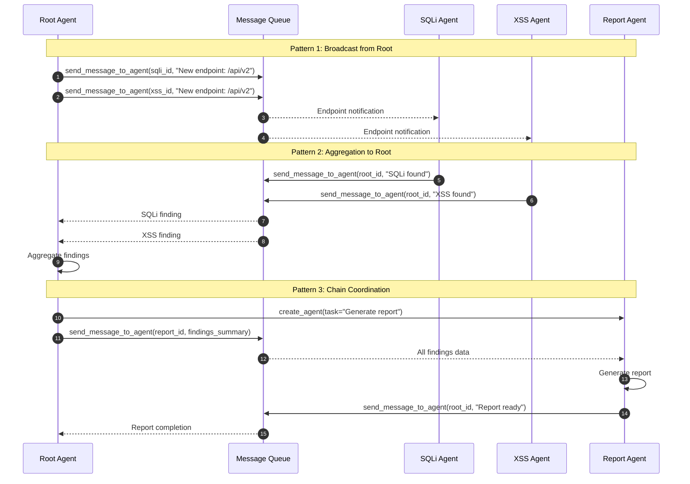
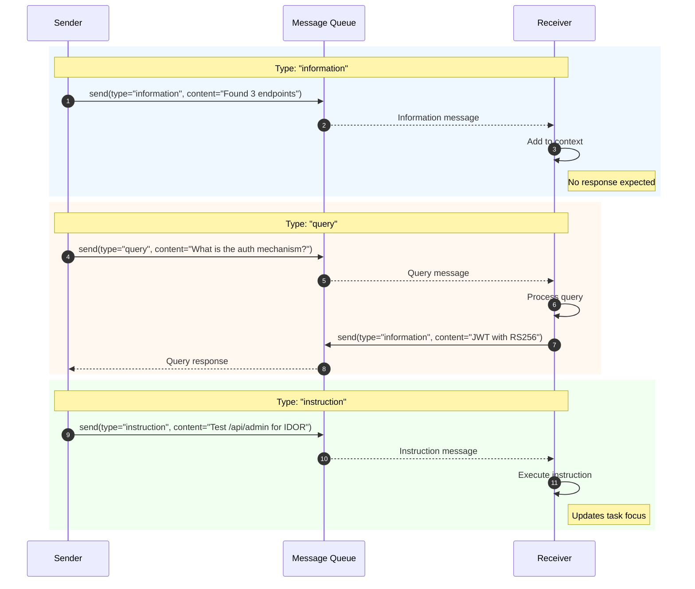
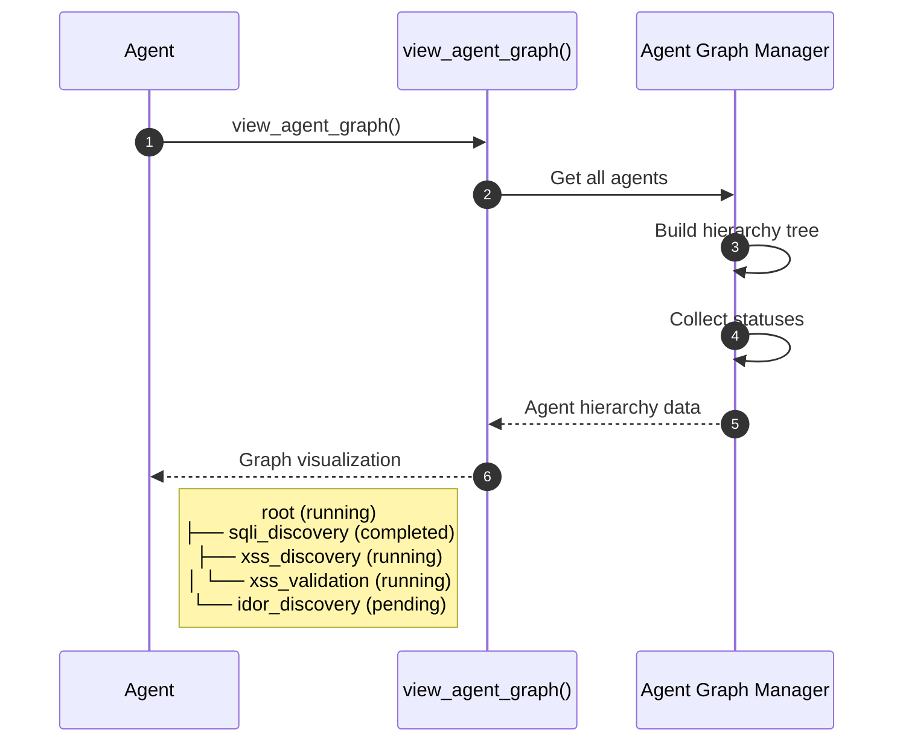
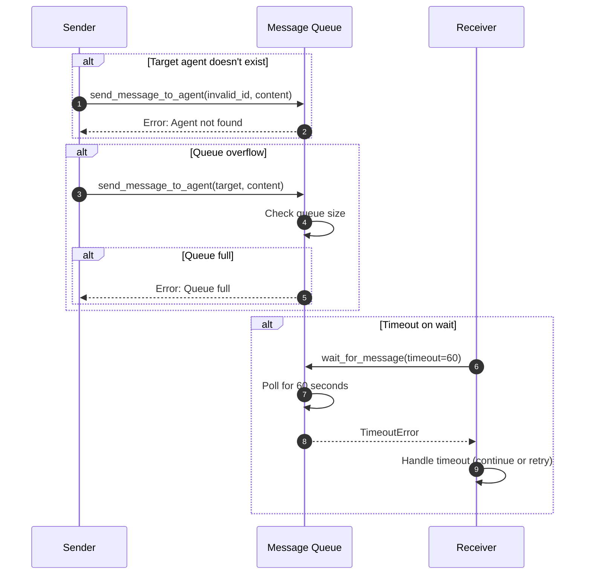

# Inter-Agent Communication

This diagram illustrates the message passing system between agents in the Strix multi-agent architecture.

## Overview

Inter-agent communication involves:
1. Message queue management for each agent
2. Asynchronous message sending between agents
3. Blocking and non-blocking message retrieval
4. Message type handling (information, query, instruction)
5. Parent-child and sibling communication patterns

## Sequence Diagram



## Multi-Agent Communication Patterns



## Message Types and Handling



## Agent Graph Visualization



## Key Components

| Component | File Location | Responsibility |
|-----------|---------------|----------------|
| send_message_to_agent | `tools/agents_graph/actions.py` | Send messages |
| wait_for_message | `tools/agents_graph/actions.py` | Blocking receive |
| view_agent_graph | `tools/agents_graph/actions.py` | Hierarchy visualization |
| Message Queue Manager | `tools/agents_graph/message_queue.py` | Queue management |
| Agent Graph Manager | `tools/agents_graph/manager.py` | Agent tracking |

## Message Structure

```python
Message:
    id: str                 # Unique message ID
    from_agent: str         # Sender agent ID
    to_agent: str           # Recipient agent ID
    content: str            # Message content
    type: str               # "information" | "query" | "instruction"
    timestamp: datetime     # Send time
    read: bool              # Read status
```

## Communication Guidelines

### When to Use Each Message Type

| Type | Use Case | Example |
|------|----------|---------|
| **information** | Share findings, status updates | "Found SQLi at /api/users" |
| **query** | Request information from another agent | "What endpoints have you discovered?" |
| **instruction** | Direct another agent's focus | "Test the admin panel next" |

### Best Practices

1. **Minimize messaging** - Agents should be autonomous; only message when necessary
2. **Use information type** - Most common; share findings without expecting response
3. **Avoid loops** - Don't create circular query patterns
4. **Parent aggregation** - Children report to parents, not siblings
5. **Clear content** - Messages become part of conversation history

## Error Handling


