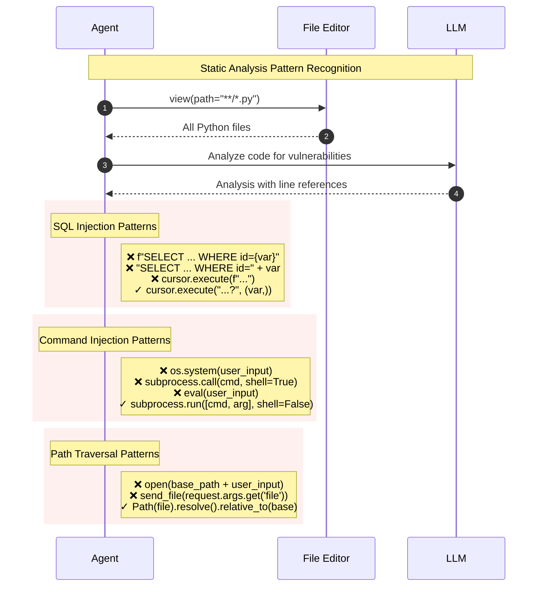
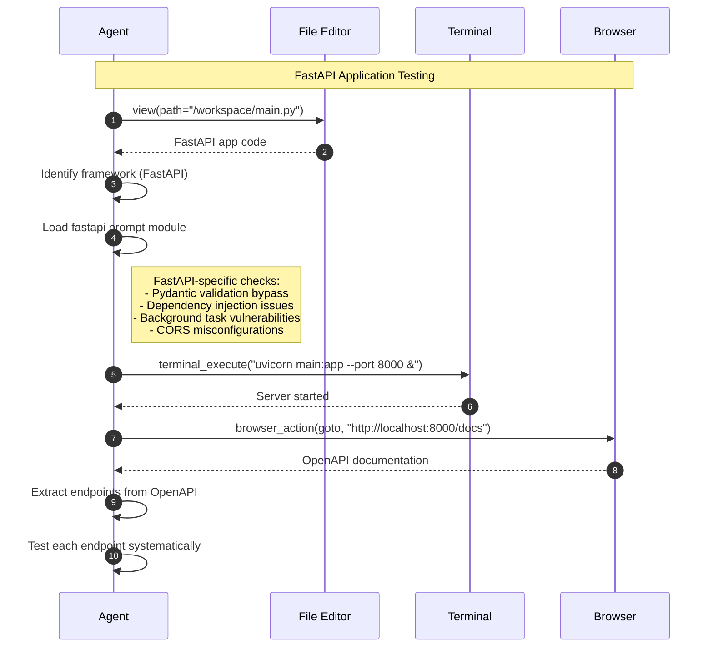
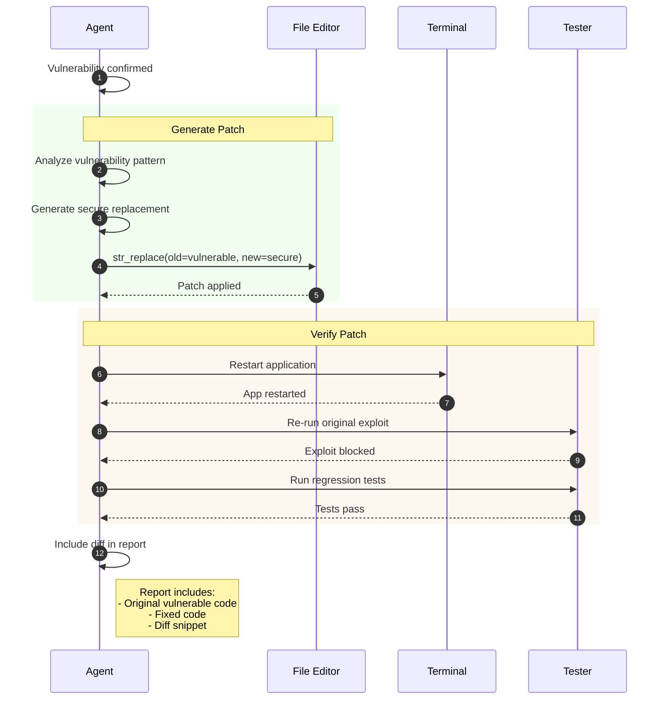

# White-Box Testing Workflow

This diagram illustrates the code-assisted security testing workflow when source code is available.

## Overview

White-box testing involves:
1. Source code loading and analysis
2. Static code review for vulnerabilities
3. Application startup and dynamic testing
4. Correlation of static and dynamic findings
5. Code patching and verification

## Sequence Diagram

```mermaid
sequenceDiagram
    autonumber
    participant Agent
    participant FileEditor as str_replace_editor
    participant Terminal as terminal_execute
    participant Python as python_action
    participant Browser as browser_action
    participant Proxy as HTTP Proxy
    participant Report as Vulnerability Reporter

    rect rgb(240, 248, 255)
        Note over Agent,FileEditor: Phase 1: Code Loading & Analysis
        Agent->>FileEditor: view(path="/workspace/src/")
        FileEditor-->>Agent: Directory listing

        Agent->>FileEditor: view(path="/workspace/src/main.py")
        FileEditor-->>Agent: Source code content

        Agent->>Agent: Analyze code structure
        Note right of Agent: Identify:<br/>- Entry points<br/>- Database queries<br/>- User input handling<br/>- Authentication logic

        loop For each interesting file
            Agent->>FileEditor: view(path=file_path)
            FileEditor-->>Agent: File content
            Agent->>Agent: Static analysis
        end
    end

    rect rgb(255, 248, 240)
        Note over Agent,FileEditor: Phase 2: Static Vulnerability Detection
        Agent->>Agent: Search for vulnerability patterns

        Note right of Agent: Pattern Examples:<br/>- f"SELECT * FROM users WHERE id={id}"<br/>- eval(user_input)<br/>- pickle.loads(data)<br/>- subprocess.call(cmd, shell=True)

        Agent->>FileEditor: view(path="/workspace/src/api/users.py")
        FileEditor-->>Agent: API handler code

        Agent->>Agent: Found: SQL string formatting
        Note right of Agent: Line 45: f"SELECT * FROM users WHERE id={request.args.get('id')}"

        Agent->>Agent: Record potential vulnerabilities
    end

    rect rgb(240, 255, 240)
        Note over Agent,Terminal: Phase 3: Application Startup
        Agent->>FileEditor: view(path="/workspace/requirements.txt")
        FileEditor-->>Agent: Dependencies

        Agent->>Terminal: terminal_execute("pip install -r requirements.txt")
        Terminal-->>Agent: Dependencies installed

        Agent->>Terminal: terminal_execute("python src/main.py &")
        Terminal-->>Agent: App starting on port 5000

        Agent->>Agent: Wait for app ready
        Agent->>Terminal: terminal_execute("curl localhost:5000/health")
        Terminal-->>Agent: {"status": "ok"}
    end

    rect rgb(255, 240, 255)
        Note over Agent,Proxy: Phase 4: Dynamic Validation
        Agent->>Proxy: scope_rules(allowlist=["localhost:5000"])

        Agent->>Browser: browser_action(launch)
        Agent->>Browser: browser_action(goto, url="http://localhost:5000")
        Browser->>Proxy: GET /
        Proxy-->>Browser: Response

        Note over Agent: Test static finding dynamically

        Agent->>Python: python_action("""
        import requests
        # Test SQLi from static analysis
        payload = "1' OR '1'='1"
        r = requests.get(
            "http://localhost:5000/api/users",
            params={"id": payload}
        )
        print(r.status_code, r.text)
        """)
        Python->>Proxy: GET /api/users?id=1' OR '1'='1
        Proxy-->>Python: Response with all users
        Python-->>Agent: SQLi confirmed - returned all users
    end

    rect rgb(255, 255, 240)
        Note over Agent,Report: Phase 5: Correlation & Reporting
        Agent->>Agent: Correlate static and dynamic findings

        Agent->>Report: create_vulnerability_report(<br/>title="SQL Injection in User API",<br/>severity="critical",<br/>content="""<br/>Location: src/api/users.py:45<br/>Code: f"SELECT * FROM users WHERE id={id}"<br/>PoC: GET /api/users?id=1' OR '1'='1<br/>Impact: Full database extraction<br/>"""<br/>)
        Report-->>Agent: Report created
    end

    rect rgb(248, 248, 255)
        Note over Agent,Terminal: Phase 6: Code Patching (Optional)
        Agent->>Agent: Generate fix

        Agent->>FileEditor: str_replace(<br/>path="/workspace/src/api/users.py",<br/>old_string='f"SELECT * FROM users WHERE id={id}"',<br/>new_string='cursor.execute("SELECT * FROM users WHERE id=?", (id,))'<br/>)
        FileEditor-->>Agent: File updated

        Agent->>Terminal: terminal_execute("python src/main.py &")
        Terminal-->>Agent: App restarted

        Agent->>Python: python_action("""<br/># Retest after patch<br/>r = requests.get(..., params={"id": "1' OR '1'='1"})<br/>print(r.status_code)<br/>""")
        Python-->>Agent: 400 Bad Request (SQLi blocked)

        Agent->>Agent: Patch verified
    end
```

## Code Analysis Patterns



## Framework-Specific Testing



## Key Components

| Component | File Location | Responsibility |
|-----------|---------------|----------------|
| str_replace_editor | `tools/file_edit/actions.py` | View/edit source code |
| terminal_execute | `tools/terminal/actions.py` | Run build/start commands |
| python_action | `tools/python/actions.py` | Execute test scripts |
| browser_action | `tools/browser/actions.py` | Interact with running app |
| Vulnerability Modules | `prompts/vulnerabilities/` | Vulnerability patterns |
| Framework Modules | `prompts/frameworks/` | Framework-specific patterns |

## White-Box vs Black-Box Correlation

| Aspect | White-Box | Black-Box | Combined Value |
|--------|-----------|-----------|----------------|
| Code Location | Known (file:line) | Unknown | Precise remediation |
| False Positives | Common (static) | Lower (dynamic) | Validated findings |
| Coverage | All code paths | Reachable paths | Complete picture |
| Effort | Fast analysis | Slower exploration | Efficient targeting |

## Testing Flow Decision Tree

```
Source Code Available?
├── YES (White-Box)
│   ├── Static Analysis → Identify Candidates
│   ├── Start Application → Enable Dynamic Testing
│   ├── Dynamic Validation → Confirm Vulnerabilities
│   └── Patch & Verify → Fix Issues
└── NO (Black-Box)
    └── See Black-Box Testing Workflow
```

## Code Patching Workflow


