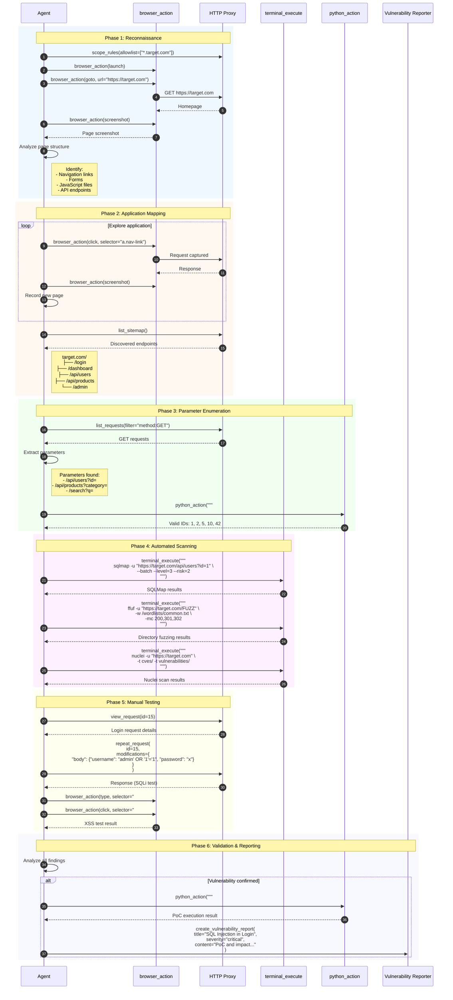
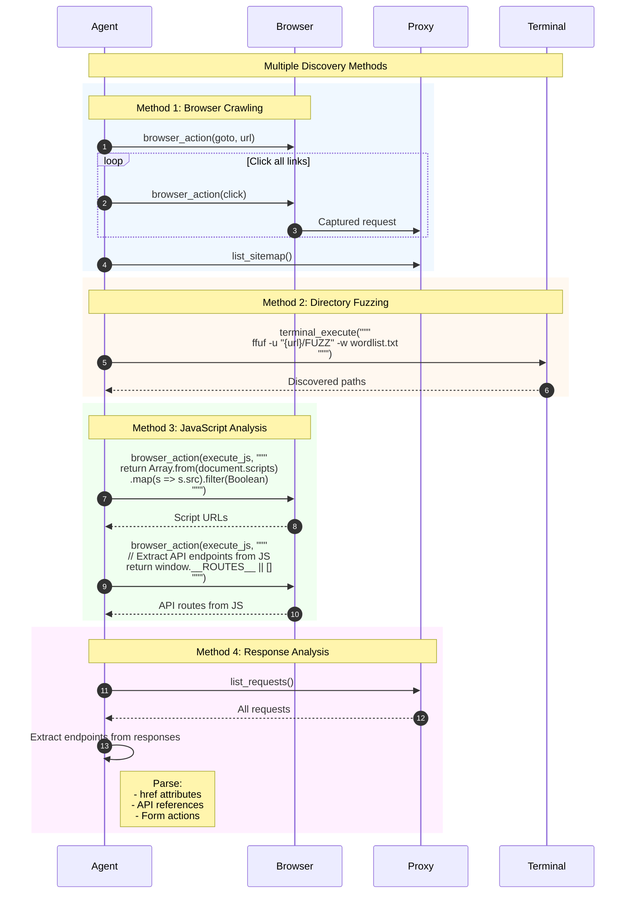
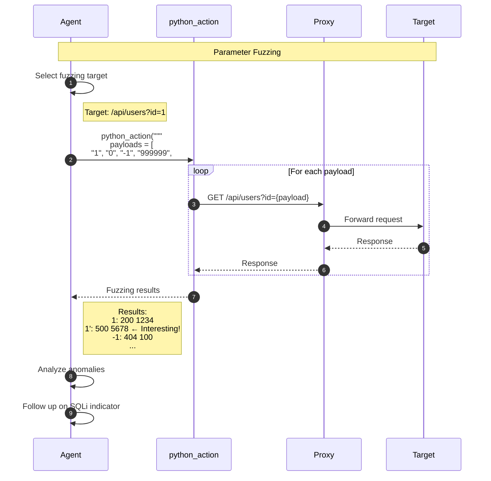
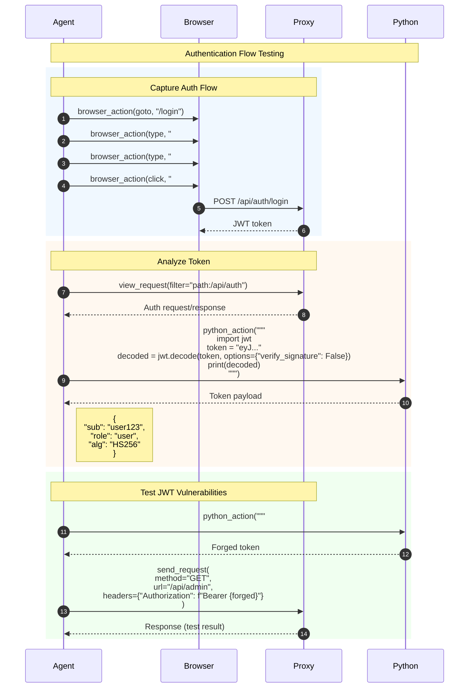

# Black-Box Testing Workflow

This diagram illustrates the external security testing workflow without source code access.

## Overview

Black-box testing involves:
1. Target reconnaissance and endpoint discovery
2. Application mapping via browser automation
3. Parameter enumeration and fuzzing
4. Vulnerability scanning and exploitation
5. Finding validation and reporting

## Sequence Diagram



## Endpoint Discovery Techniques



## Fuzzing Workflow



## Authentication Testing



## Key Components

| Component | File Location | Responsibility |
|-----------|---------------|----------------|
| browser_action | `tools/browser/actions.py` | Web automation |
| terminal_execute | `tools/terminal/actions.py` | Security tools (sqlmap, ffuf) |
| python_action | `tools/python/actions.py` | Custom fuzzing scripts |
| Proxy Tools | `tools/proxy/actions.py` | Traffic analysis |
| Vulnerability Modules | `prompts/vulnerabilities/` | Attack patterns |

## Scanning Tools Integration

| Tool | Purpose | Example Command |
|------|---------|-----------------|
| **sqlmap** | SQL injection | `sqlmap -u "url?id=1" --batch` |
| **ffuf** | Fuzzing | `ffuf -u "url/FUZZ" -w wordlist.txt` |
| **nuclei** | Vulnerability scanning | `nuclei -u "url" -t cves/` |
| **nikto** | Web server scanning | `nikto -h "url"` |
| **wfuzz** | Parameter fuzzing | `wfuzz -z file,wordlist "url?FUZZ=test"` |

## Black-Box Testing Phases

```
Phase 1: Reconnaissance
├── Passive: DNS, WHOIS, certificate transparency
└── Active: Port scanning, banner grabbing

Phase 2: Mapping
├── Browser crawling
├── Directory fuzzing
└── JavaScript analysis

Phase 3: Enumeration
├── Parameter discovery
├── Hidden endpoint discovery
└── User enumeration

Phase 4: Vulnerability Scanning
├── Automated scanners (sqlmap, nuclei)
├── Manual payload testing
└── Business logic testing

Phase 5: Exploitation
├── PoC development
├── Impact demonstration
└── Data extraction proof

Phase 6: Reporting
├── Vulnerability documentation
├── Reproduction steps
└── Remediation guidance
```

## Response Analysis Patterns

| Response Pattern | Potential Vulnerability |
|------------------|------------------------|
| 500 error on special chars | SQL/Command injection |
| Different response length | Boolean-based injection |
| Delayed response | Time-based injection |
| Error message exposure | Information disclosure |
| Reflected input | XSS potential |
| Path in error | Path traversal |
