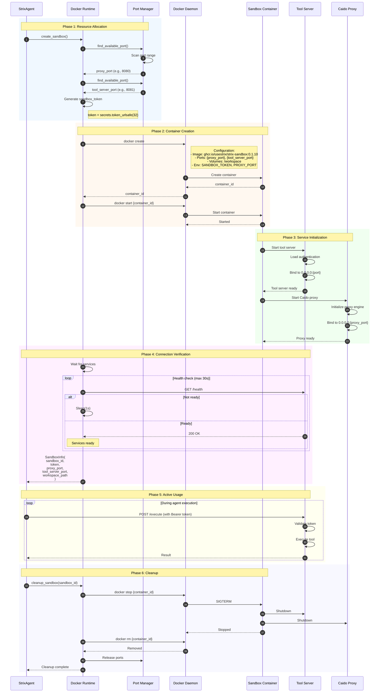
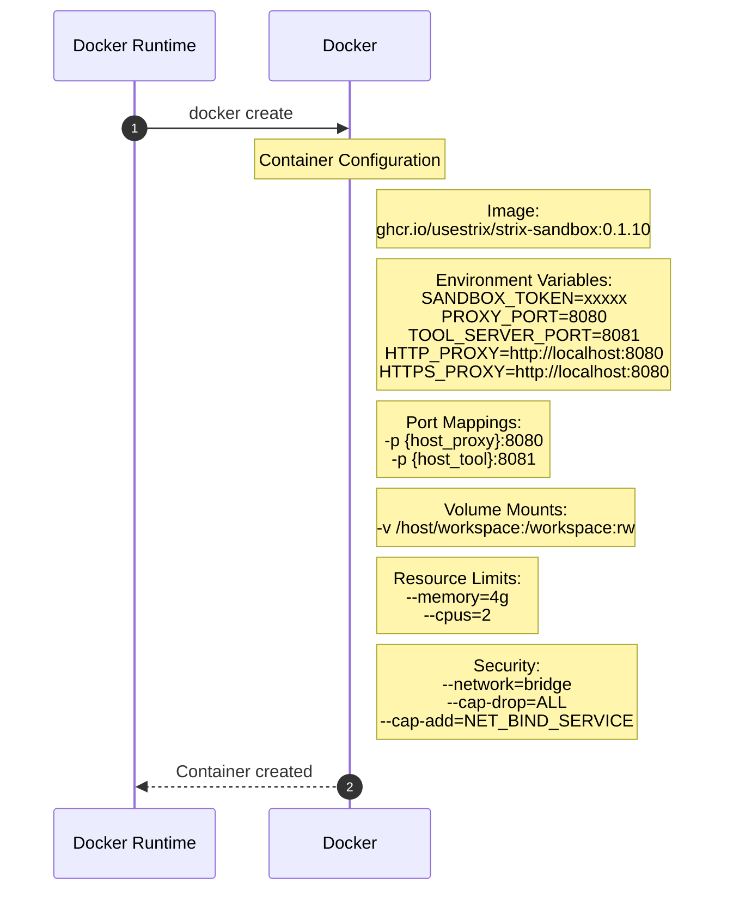
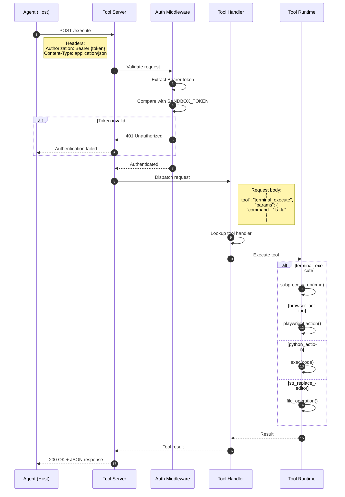
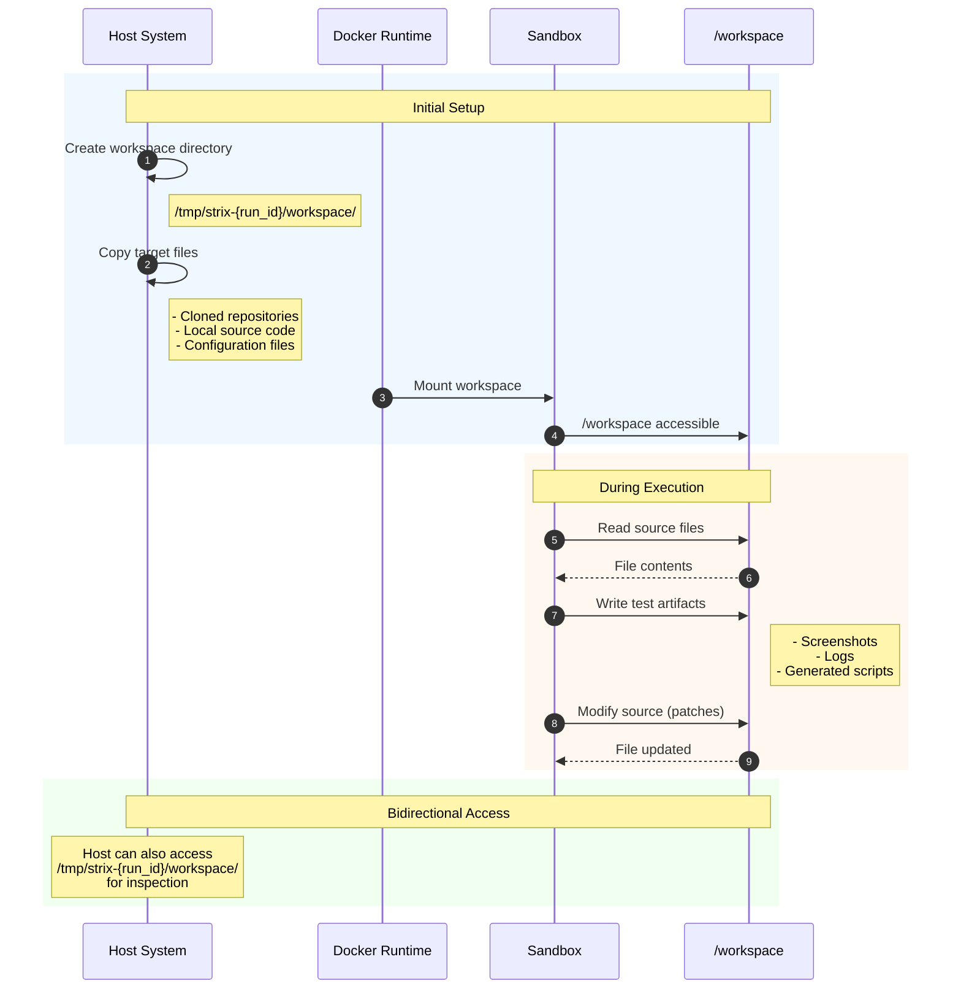
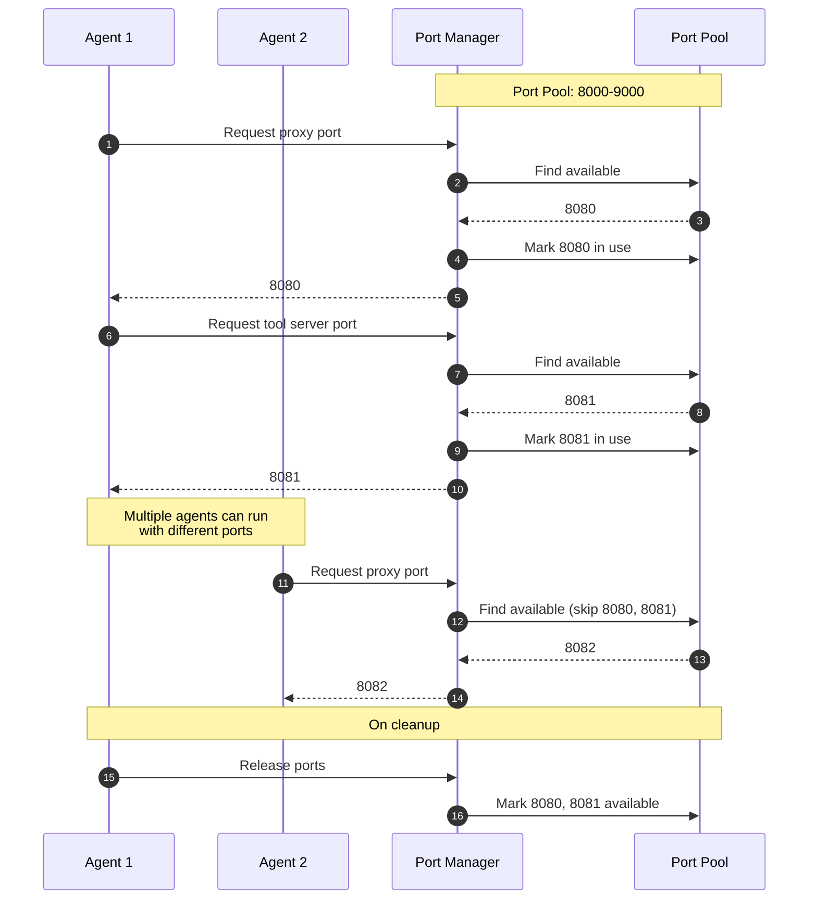
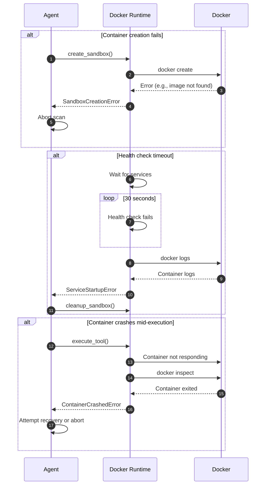

# Sandbox Lifecycle Management

This diagram illustrates Docker container lifecycle management for the isolated execution environment.

## Overview

Sandbox lifecycle management involves:
1. Container creation with proper configuration
2. Port allocation for proxy and tool server
3. Tool server initialization and authentication
4. Workspace mounting and file access
5. Graceful shutdown and cleanup

## Sequence Diagram



## Container Configuration



## Tool Server Architecture



## Workspace Management



## Port Allocation Strategy



## Key Components

| Component | File Location | Responsibility |
|-----------|---------------|----------------|
| Docker Runtime | `runtime/docker_runtime.py` | Container lifecycle |
| Tool Server | `runtime/tool_server.py` | Request handling in sandbox |
| Port Manager | `runtime/docker_runtime.py` | Port allocation |
| Workspace Manager | `utils/utils.py` | File preparation |

## Container Services

| Service | Port | Purpose |
|---------|------|---------|
| Tool Server | 8081 (default) | Execute tools via HTTP |
| Caido Proxy | 8080 (default) | HTTP traffic interception |
| Browser | N/A | Playwright automation |
| Python Runtime | N/A | Code execution |
| Terminal | N/A | Shell command execution |

## Sandbox Security Model

```
┌─────────────────────────────────────────────────┐
│                 Host System                      │
│  ┌───────────────────────────────────────────┐  │
│  │            Docker Container                │  │
│  │  ┌─────────────────────────────────────┐  │  │
│  │  │  Isolated Network (bridge)          │  │  │
│  │  │  - No host network access           │  │  │
│  │  │  - Controlled port exposure         │  │  │
│  │  └─────────────────────────────────────┘  │  │
│  │                                           │  │
│  │  ┌─────────────────────────────────────┐  │  │
│  │  │  Limited Capabilities               │  │  │
│  │  │  - cap-drop=ALL                     │  │  │
│  │  │  - Only NET_BIND_SERVICE            │  │  │
│  │  └─────────────────────────────────────┘  │  │
│  │                                           │  │
│  │  ┌─────────────────────────────────────┐  │  │
│  │  │  Resource Limits                    │  │  │
│  │  │  - Memory: 4GB                      │  │  │
│  │  │  - CPU: 2 cores                     │  │  │
│  │  └─────────────────────────────────────┘  │  │
│  │                                           │  │
│  │  ┌─────────────────────────────────────┐  │  │
│  │  │  Authenticated Access               │  │  │
│  │  │  - Bearer token required            │  │  │
│  │  │  - Token generated per session      │  │  │
│  │  └─────────────────────────────────────┘  │  │
│  └───────────────────────────────────────────┘  │
│                                                  │
│  ┌───────────────────────────────────────────┐  │
│  │  Mounted Volume (/workspace)              │  │
│  │  - Read/Write access                      │  │
│  │  - Isolated from host filesystem          │  │
│  └───────────────────────────────────────────┘  │
└─────────────────────────────────────────────────┘
```

## Error Handling


