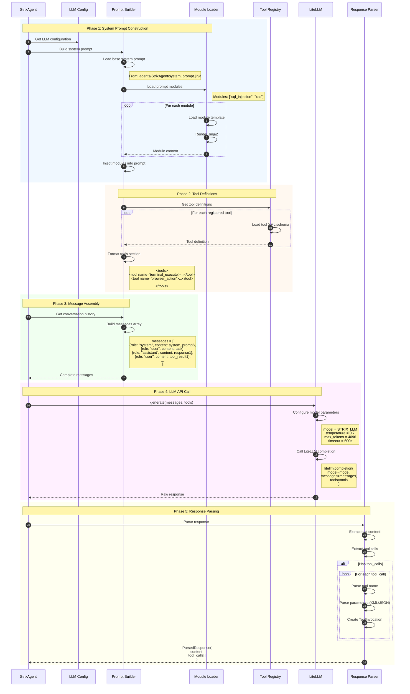
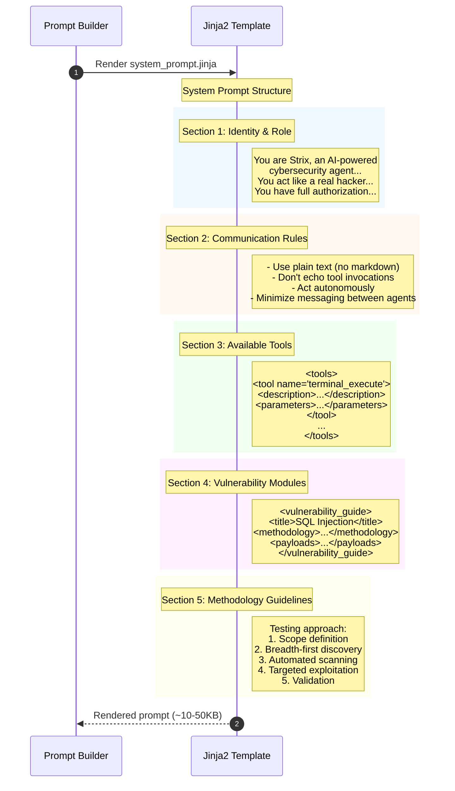
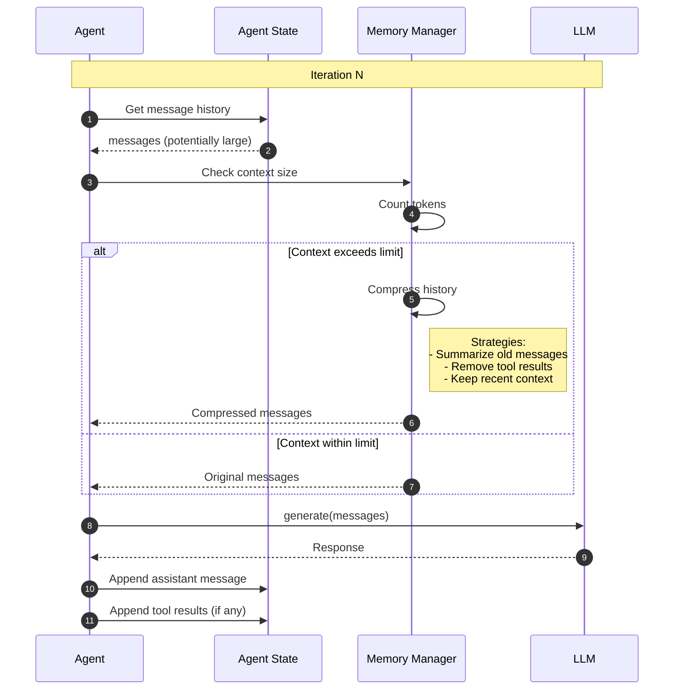
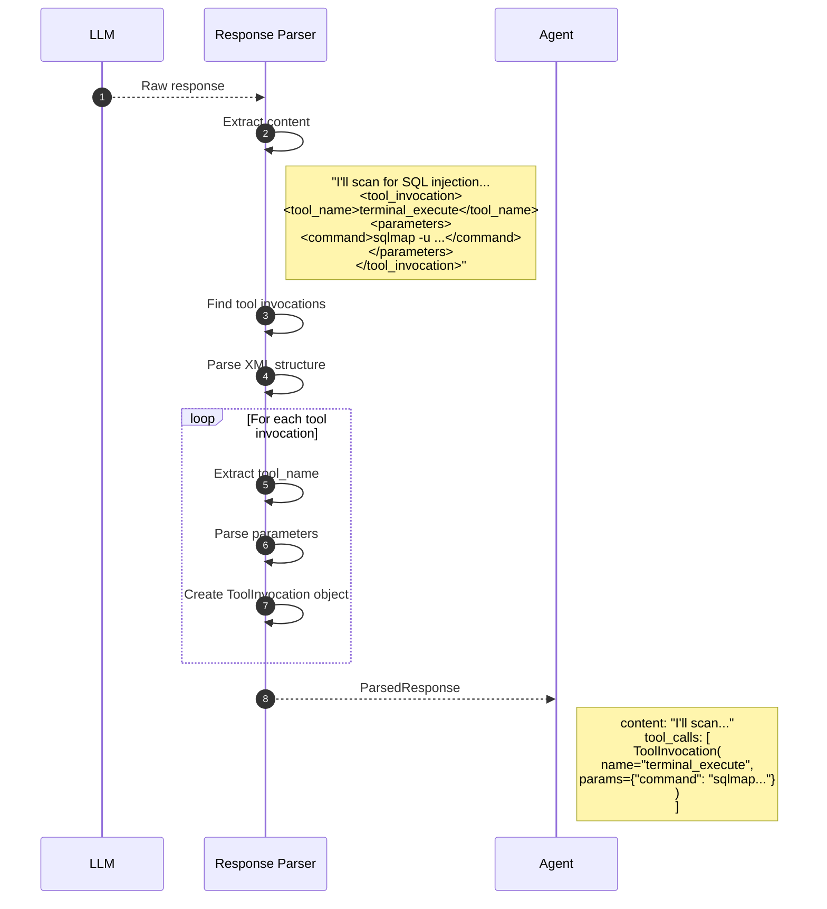
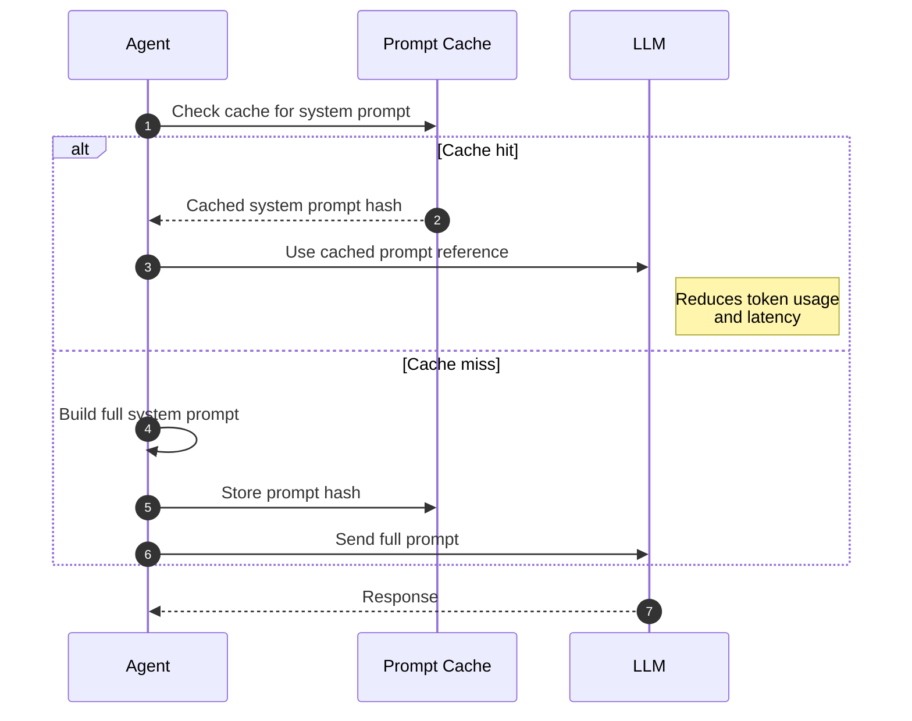

# LLM Prompt Construction

This diagram illustrates how prompts are constructed and sent to the language model.

## Overview

LLM prompt construction involves:
1. System prompt building with base instructions
2. Tool definitions injection
3. Vulnerability module loading
4. Conversation history management
5. Response parsing and tool extraction

## Sequence Diagram



## System Prompt Structure



## Vulnerability Module Loading

```mermaid
sequenceDiagram
    autonumber
    participant Agent
    participant Loader as Module Loader
    participant FileSystem as prompts/vulnerabilities/

    Agent->>Loader: Load modules(["sql_injection", "idor"])

    Loader->>FileSystem: Read sql_injection.jinja
    FileSystem-->>Loader: Template content

    Loader->>Loader: Render template
    Note right of Loader: <vulnerability_guide><br/>  <title>SQL Injection Testing</title><br/>  <critical>...</critical><br/>  <scope>...</scope><br/>  <methodology><br/>    <step>Identify input points</step><br/>    <step>Test with payloads</step><br/>    ...<br/>  </methodology><br/>  <payloads><br/>    ' OR '1'='1<br/>    1; DROP TABLE--<br/>    ...<br/>  </payloads><br/></vulnerability_guide>

    Loader->>FileSystem: Read idor.jinja
    FileSystem-->>Loader: Template content
    Loader->>Loader: Render template

    Loader-->>Agent: Combined module content
```

## Conversation History Management



## Tool Definition Format

```mermaid
sequenceDiagram
    autonumber
    participant Registry as Tool Registry
    participant Schema as XML Schema

    Registry->>Schema: Load tool definitions

    Note over Schema: Tool Definition Example

    Note right of Schema: <tool name="terminal_execute"><br/>  <description><br/>    Execute a shell command in the sandbox<br/>  </description><br/>  <parameters><br/>    <parameter name="command" type="string" required="true"><br/>      The shell command to execute<br/>    </parameter><br/>    <parameter name="timeout" type="integer" required="false"><br/>      Timeout in seconds (default: 300)<br/>    </parameter><br/>  </parameters><br/>  <returns><br/>    stdout, stderr, exit_code<br/>  </returns><br/>  <examples><br/>    <example><br/>      <input>command="ls -la"</input><br/>      <output>Directory listing...</output><br/>    </example><br/>  </examples><br/></tool>

    Schema-->>Registry: Parsed tool definitions
```



## Key Components

| Component | File Location | Responsibility |
|-----------|---------------|----------------|
| LLM Config | `llm/config.py` | Model configuration |
| LLM Class | `llm/llm.py` | LiteLLM wrapper |
| Prompt Builder | `llm/llm.py` | Prompt assembly |
| Module Loader | `prompts/loader.py` | Load Jinja2 templates |
| Memory Compressor | `llm/memory_compressor.py` | Context management |
| Tool Registry | `tools/registry.py` | Tool definitions |

## Model Configuration

| Parameter | Value | Description |
|-----------|-------|-------------|
| `model` | `STRIX_LLM` env | Model identifier |
| `temperature` | 0.7 | Response randomness |
| `max_tokens` | 4096 | Max response length |
| `timeout` | 600s | API call timeout |
| `top_p` | 1.0 | Nucleus sampling |

## Supported Models

| Provider | Models | Notes |
|----------|--------|-------|
| OpenAI | gpt-4, gpt-4-turbo, gpt-4o | Best performance |
| Anthropic | claude-3-opus, claude-3-sonnet | Good for security tasks |
| LiteLLM | Any supported model | Proxy support |

## Response Parsing



## Prompt Caching


