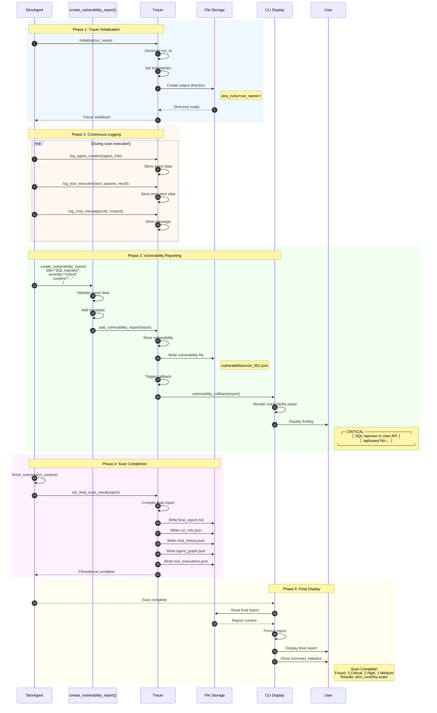
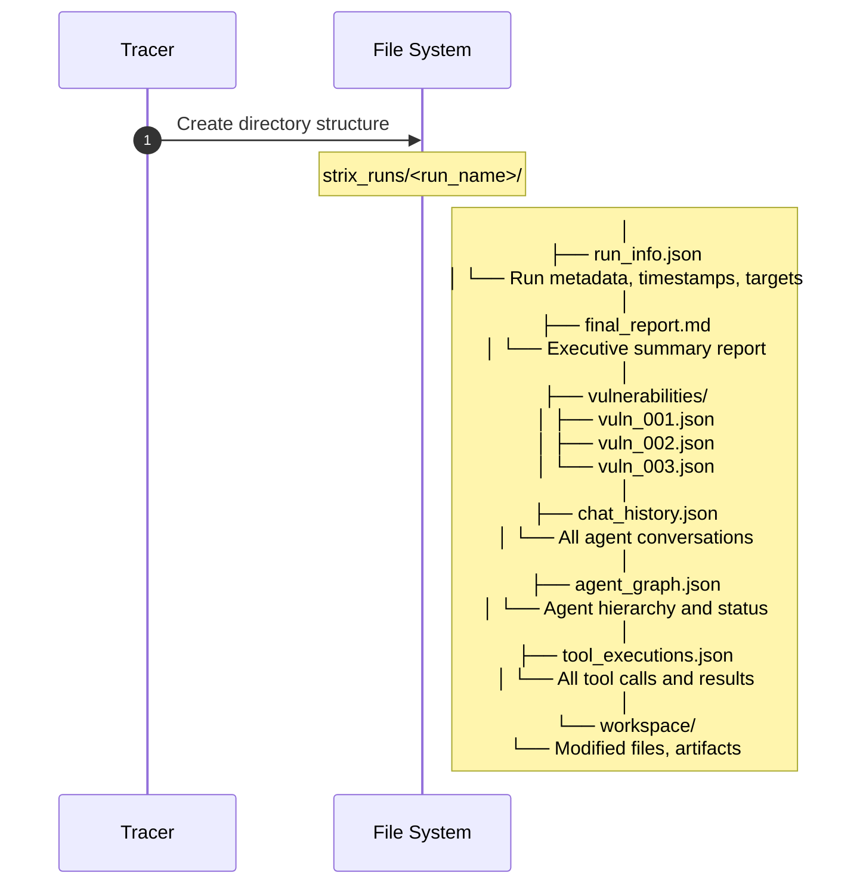
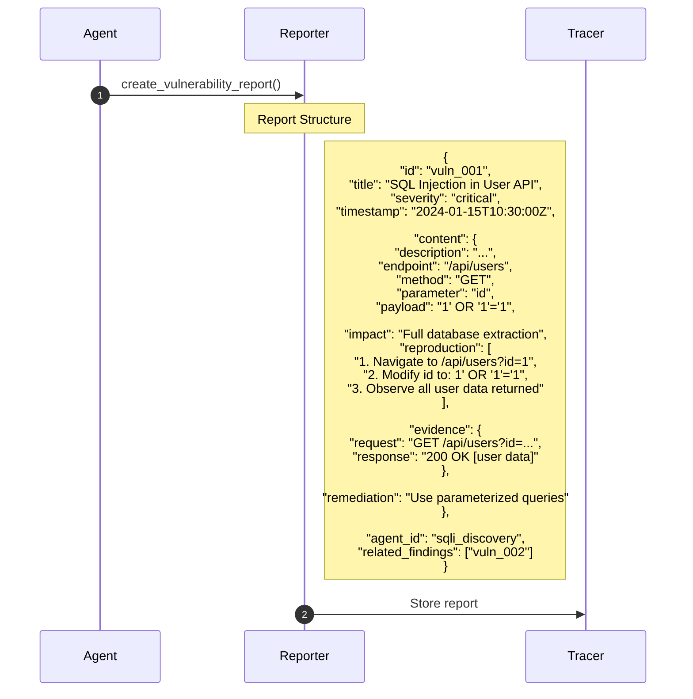
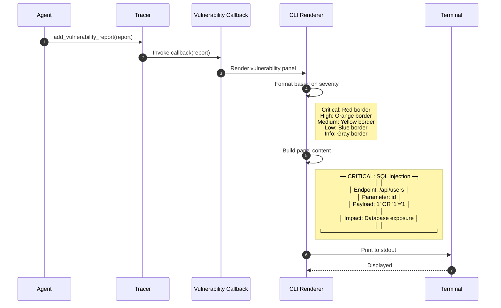
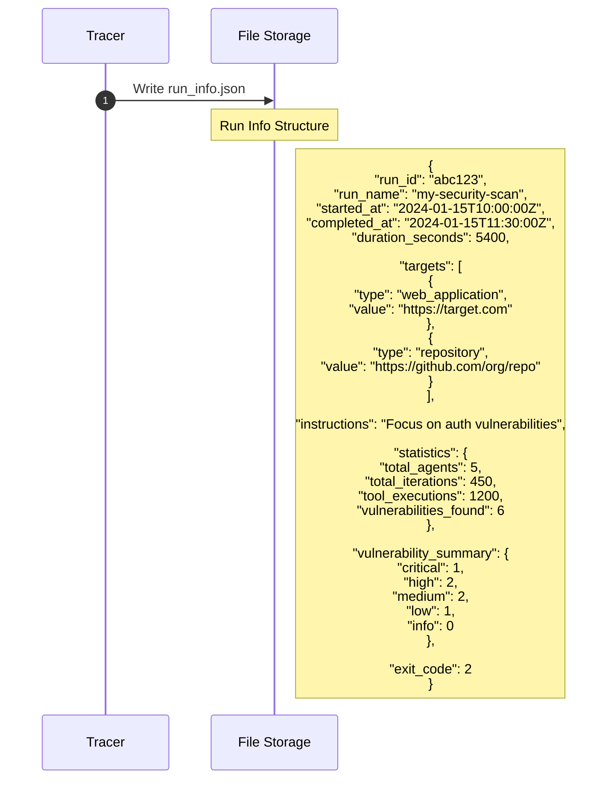
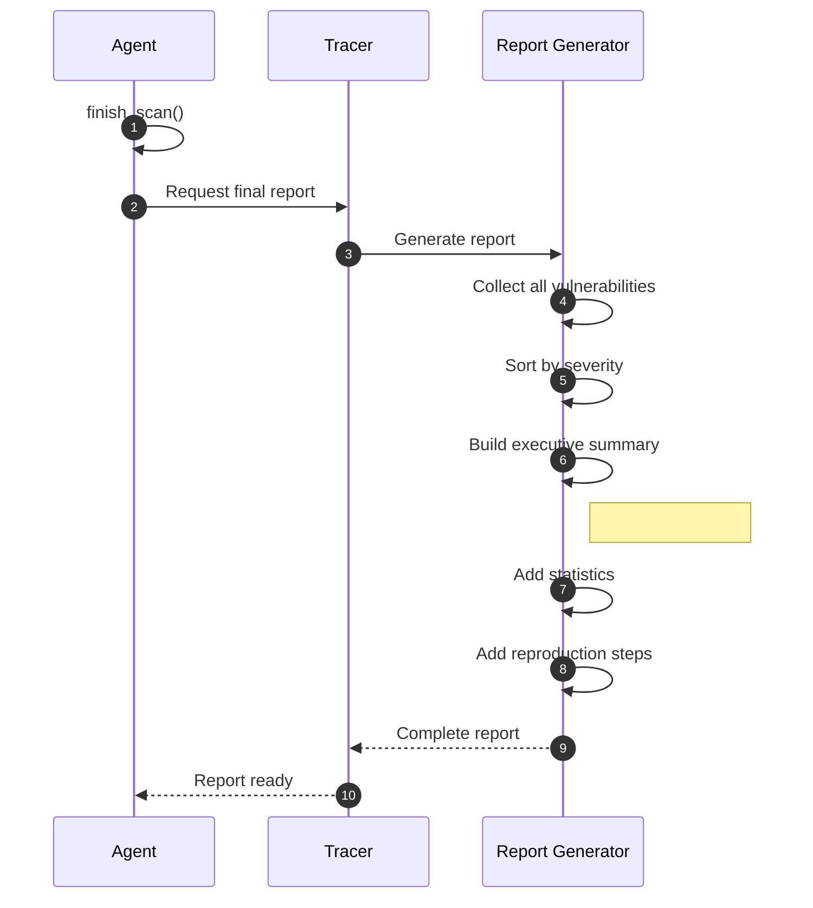

# Scan Result Persistence

This diagram illustrates how scan results, vulnerability reports, and telemetry are persisted.

## Overview

Scan result persistence involves:
1. Telemetry collection during scan execution
2. Vulnerability report storage
3. Final scan result generation
4. Output directory structure
5. Report formatting and display

## Sequence Diagram

## Output Directory Structure

## Vulnerability Report Structure

## Real-Time Display Flow

## Run Info Structure

## Key Components

| Component | File Location | Responsibility |
|-----------|---------------|----------------|
| Tracer | `telemetry/tracer.py` | Central telemetry collection |
| create_vulnerability_report | `tools/reporting/actions.py` | Report creation tool |
| CLI Renderer | `interface/tool_components/reporting_renderer.py` | Display formatting |
| Storage Manager | `utils/utils.py` | File operations |

## Output File Formats

| File | Format | Content |
|------|--------|---------|
| `run_info.json` | JSON | Run metadata, statistics |
| `final_report.md` | Markdown | Executive summary |
| `vulnerabilities/*.json` | JSON | Individual findings |
| `chat_history.json` | JSON | All conversations |
| `agent_graph.json` | JSON | Agent hierarchy |
| `tool_executions.json` | JSON | Tool call log |

## Exit Codes

| Code | Meaning |
|------|---------|
| 0 | Scan completed, no vulnerabilities found |
| 1 | Scan failed with error |
| 2 | Scan completed, vulnerabilities found |

## Report Generation Flow

## Persistence Guarantees

1. **Atomic writes** - Files written atomically to prevent corruption
2. **Incremental saving** - Vulnerabilities saved as found
3. **Crash recovery** - Partial results preserved on failure
4. **Idempotent** - Safe to re-run with same run_name
