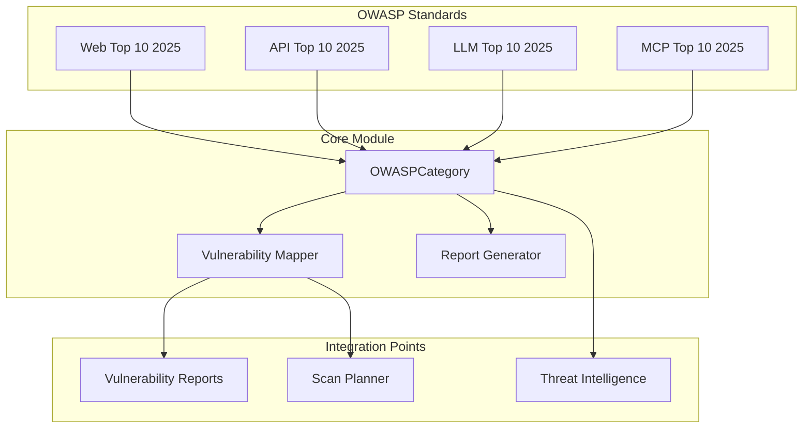
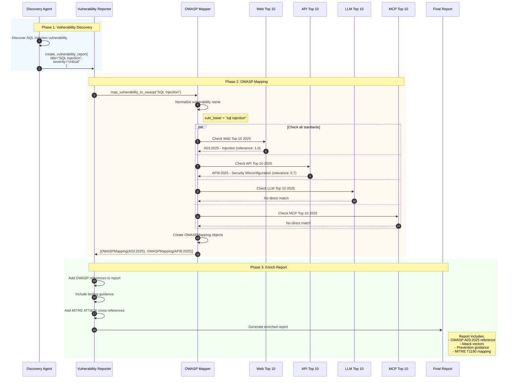
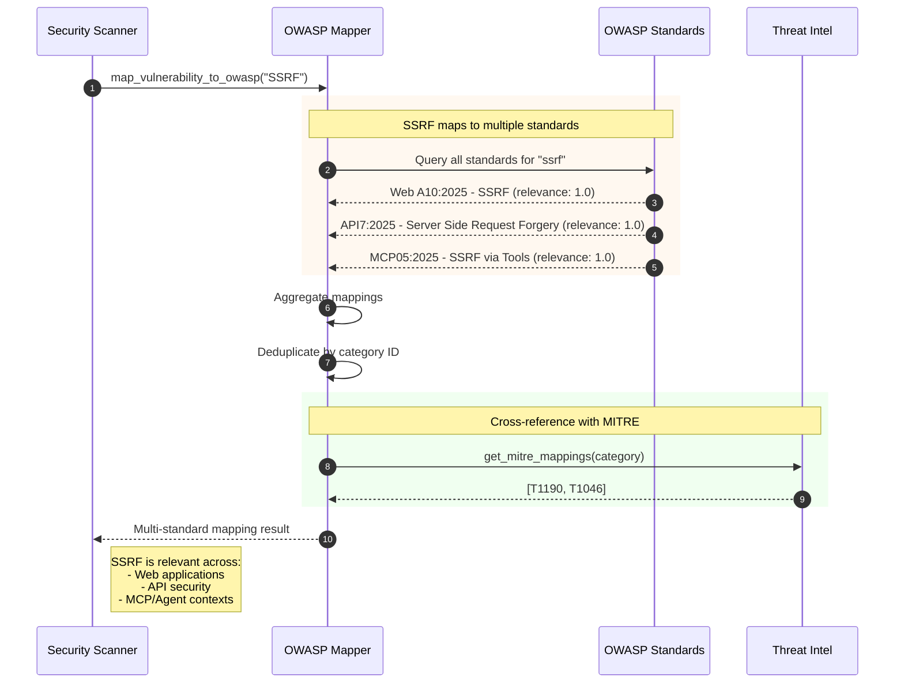
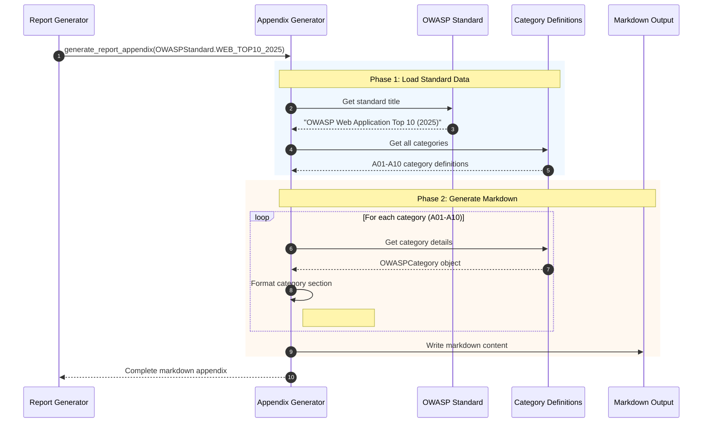
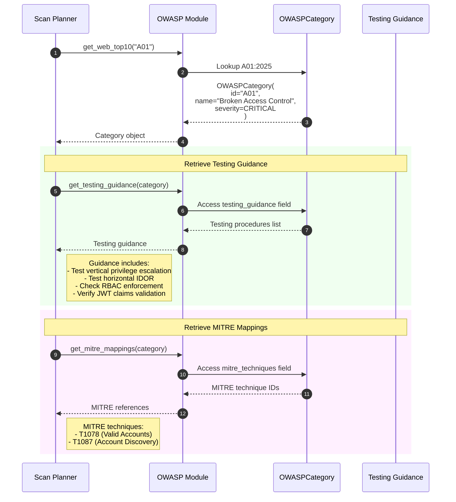
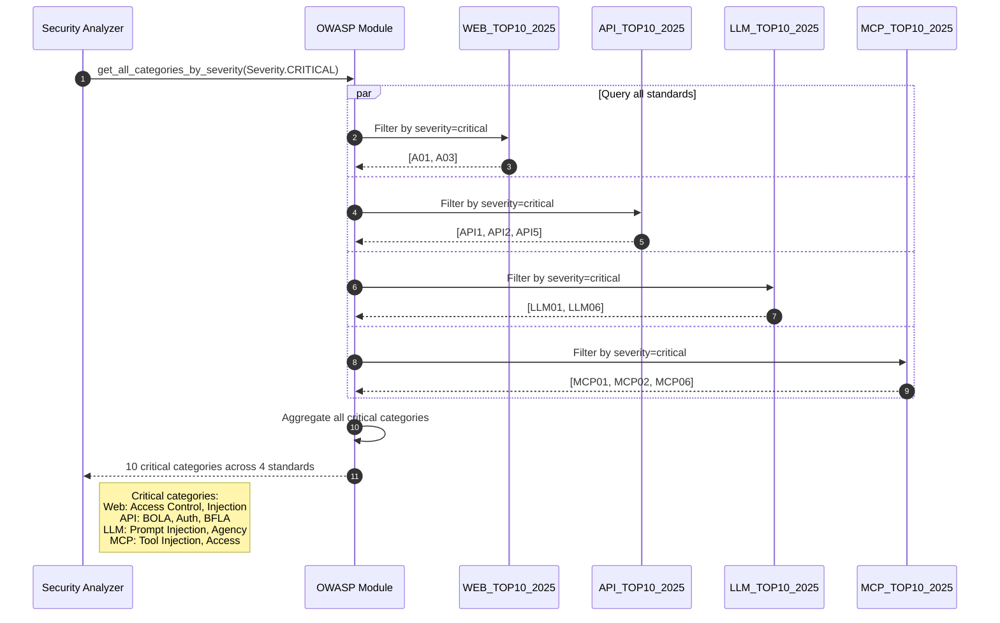

# OWASP Top 10 Integration & Mapping

This diagram illustrates how Strix integrates OWASP Top 10 standards for comprehensive vulnerability classification across multiple security domains.

## Overview

The OWASP integration provides:
1. Four OWASP Top 10 standards (Web, API, LLM, MCP - all 2025 editions)
2. Automated vulnerability-to-OWASP category mapping
3. Cross-standard correlation for multi-domain vulnerabilities
4. Report appendix generation with detailed guidance
5. MITRE ATT&CK cross-references for threat intelligence

## Architecture



## Sequence Diagram: Vulnerability to OWASP Mapping



## Sequence Diagram: Multi-Standard Vulnerability Mapping



## Sequence Diagram: Report Appendix Generation



## Sequence Diagram: OWASP Category Lookup with Testing Guidance



## Sequence Diagram: Severity-Based Category Filtering



## Key Components

| Component | File Location | Responsibility |
|-----------|---------------|----------------|
| OWASP Module | `strix/core/owasp/__init__.py` | Main exports and utility functions |
| Base Classes | `strix/core/owasp/base.py` | OWASPCategory, OWASPMapping, enums |
| Web Top 10 | `strix/core/owasp/web_applications.py` | OWASP Web Application Top 10 2025 |
| API Top 10 | `strix/core/owasp/api_security.py` | OWASP API Security Top 10 2025 |
| LLM Top 10 | `strix/core/owasp/llm_top10.py` | OWASP LLM Top 10 2025 |
| MCP Top 10 | `strix/core/owasp/mcp_top10.py` | OWASP MCP Top 10 2025 |
| Scan Planner | `strix/agents/planner.py` | Integrates OWASP refs into scan steps |

## OWASP Standards Coverage

### Web Application Top 10 (2025)

| ID | Category | Severity |
|----|----------|----------|
| A01 | Broken Access Control | Critical |
| A02 | Cryptographic Failures | High |
| A03 | Injection | Critical |
| A04 | Insecure Design | High |
| A05 | Security Misconfiguration | Medium |
| A06 | Vulnerable and Outdated Components | Medium |
| A07 | Identification and Authentication Failures | High |
| A08 | Software and Data Integrity Failures | High |
| A09 | Security Logging and Monitoring Failures | Medium |
| A10 | Server-Side Request Forgery (SSRF) | High |

### API Security Top 10 (2025)

| ID | Category | Severity |
|----|----------|----------|
| API1 | Broken Object Level Authorization | Critical |
| API2 | Broken Authentication | Critical |
| API3 | Broken Object Property Level Authorization | High |
| API4 | Unrestricted Resource Consumption | Medium |
| API5 | Broken Function Level Authorization | Critical |
| API6 | Unrestricted Access to Sensitive Business Flows | Medium |
| API7 | Server Side Request Forgery | High |
| API8 | Security Misconfiguration | High |
| API9 | Improper Inventory Management | Medium |
| API10 | Unsafe Consumption of APIs | Medium |

### LLM Top 10 (2025)

| ID | Category | Severity |
|----|----------|----------|
| LLM01 | Prompt Injection | Critical |
| LLM02 | Sensitive Information Disclosure | High |
| LLM03 | Supply Chain Vulnerabilities | Medium |
| LLM04 | Data and Model Poisoning | High |
| LLM05 | Improper Output Handling | High |
| LLM06 | Excessive Agency | Critical |
| LLM07 | System Prompt Leakage | Medium |
| LLM08 | Vector and Embedding Weaknesses | Medium |
| LLM09 | Misinformation | Medium |
| LLM10 | Unbounded Consumption | Medium |

### MCP Top 10 (2025)

| ID | Category | Severity |
|----|----------|----------|
| MCP01 | Tool Injection | Critical |
| MCP02 | Resource Access Control Bypass | Critical |
| MCP03 | Sensitive Information Disclosure | High |
| MCP04 | Insecure Transport | Medium |
| MCP05 | Server-Side Request Forgery via Tools | High |
| MCP06 | Insecure Tool Execution | Critical |
| MCP07 | Insufficient Audit Logging | Medium |
| MCP08 | Excessive Permissions | High |
| MCP09 | Denial of Service | Medium |
| MCP10 | Insufficient Input Validation | High |

## OWASPCategory Data Structure

```python
@dataclass
class OWASPCategory:
    id: str                              # "A01", "API1", "LLM01", "MCP01"
    name: str                            # Category name
    description: str                     # Full description
    standard: OWASPStandard              # Which Top 10 standard
    severity: Severity                   # critical, high, medium, low
    cwe_ids: list[str]                   # Related CWE IDs
    attack_vectors: list[str]            # How it's exploited
    impact: str                          # Business impact
    detection_methods: list[str]         # How to detect
    prevention: list[str]                # Mitigation strategies
    testing_guidance: list[str]          # Testing procedures
    examples: list[str]                  # Exploit examples
    mitre_techniques: list[str]          # MITRE ATT&CK mappings
    url: str                             # OWASP reference URL
```

## Cross-Standard Vulnerability Mapping

```
Vulnerability Type → OWASP Mappings:
├── SQL Injection
│   ├── Web A03:2025 (Injection) - relevance: 1.0
│   └── API8:2025 (Misconfiguration) - relevance: 0.7
├── SSRF
│   ├── Web A10:2025 (SSRF) - relevance: 1.0
│   ├── API7:2025 (SSRF) - relevance: 1.0
│   └── MCP05:2025 (SSRF via Tools) - relevance: 1.0
├── Prompt Injection
│   ├── LLM01:2025 (Prompt Injection) - relevance: 1.0
│   └── MCP01:2025 (Tool Injection) - relevance: 0.9
├── IDOR
│   ├── Web A01:2025 (Broken Access Control) - relevance: 1.0
│   └── API1:2025 (BOLA) - relevance: 1.0
└── Authentication
    ├── Web A07:2025 (Auth Failures) - relevance: 1.0
    └── API2:2025 (Broken Auth) - relevance: 1.0
```

## Integration with Scan Planner

The OWASP module integrates with the Scan Planner to provide threat intelligence tagging:

```python
# Each ScanStep includes OWASP references
ScanStep(
    module="sql_injection",
    owasp_refs=[
        OWASPReference(
            category_id="A03:2025",
            category_name="Injection",
            standard="Web Top 10 2025",
            severity="critical"
        )
    ],
    cwe_ids=["CWE-89", "CWE-564"],
    mitre_ttps=[...]
)
```
