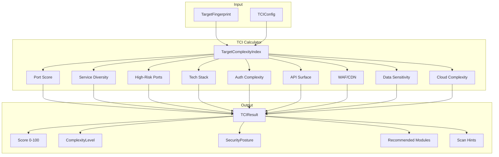
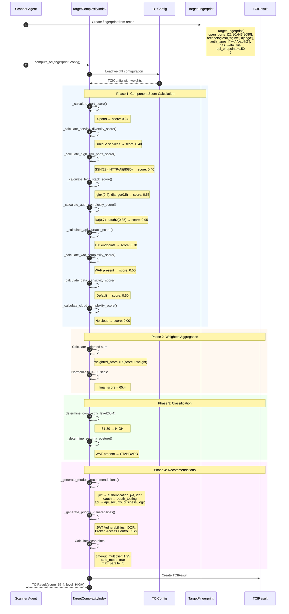
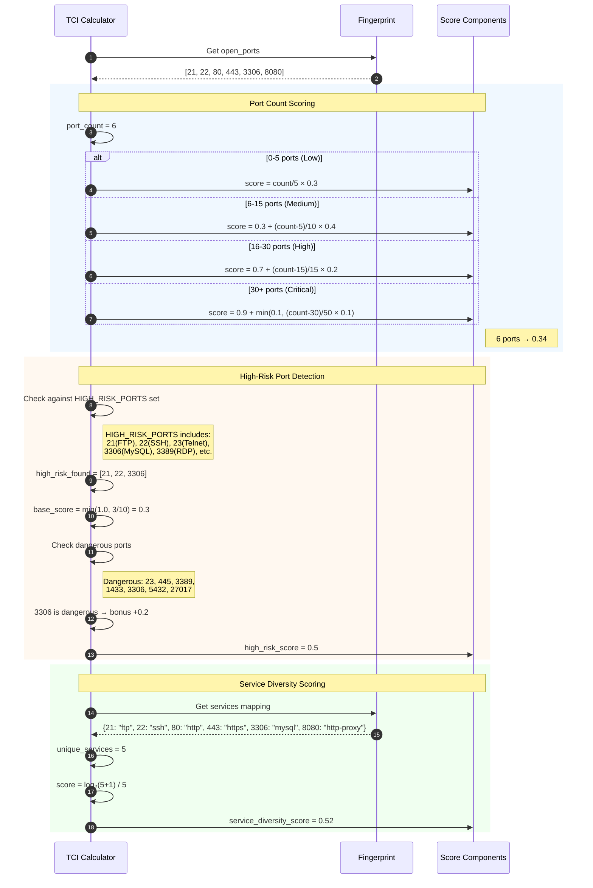
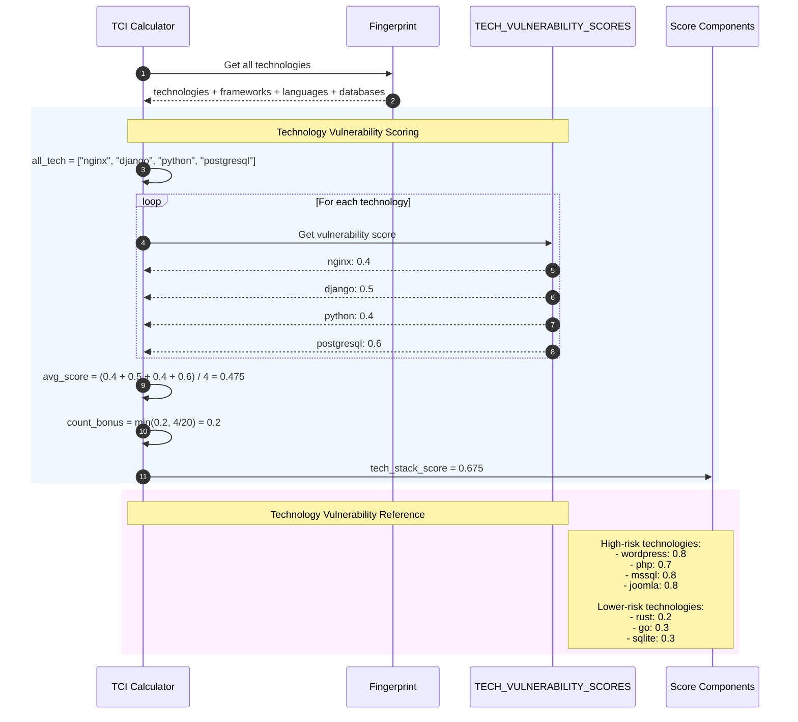
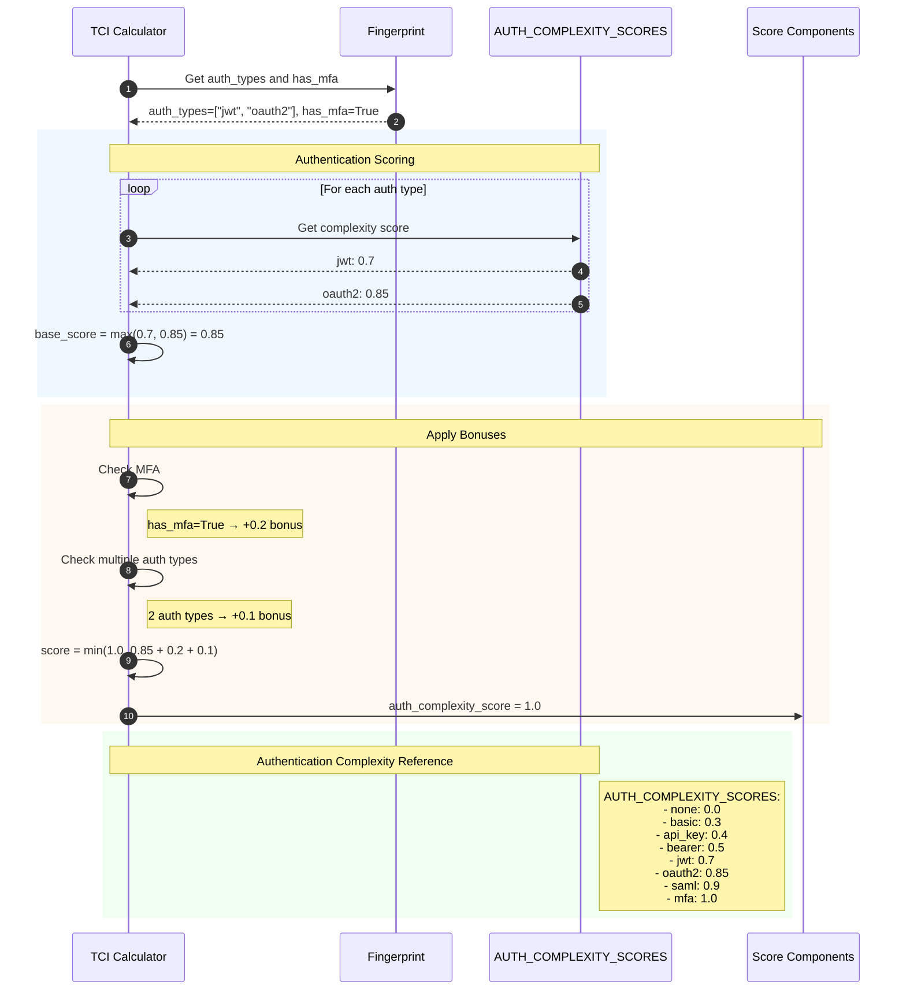
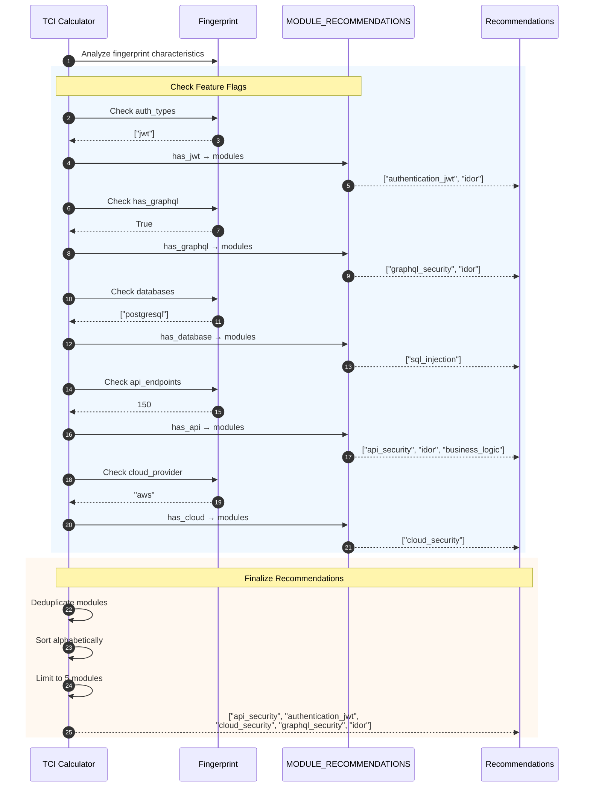
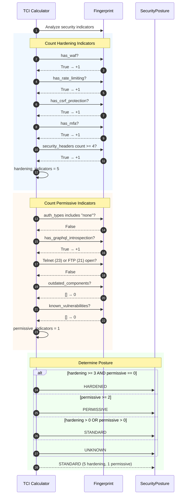
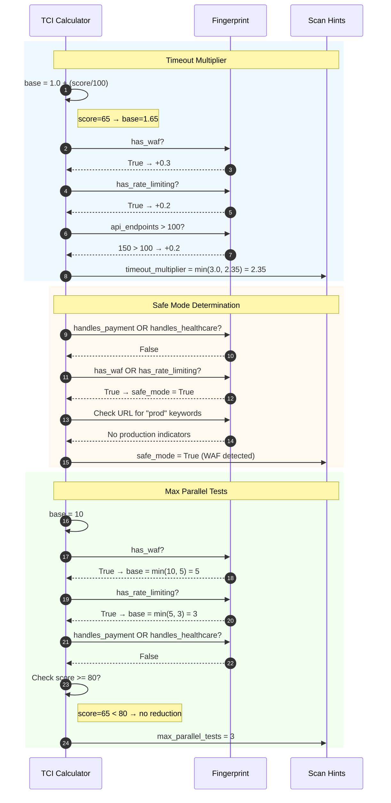
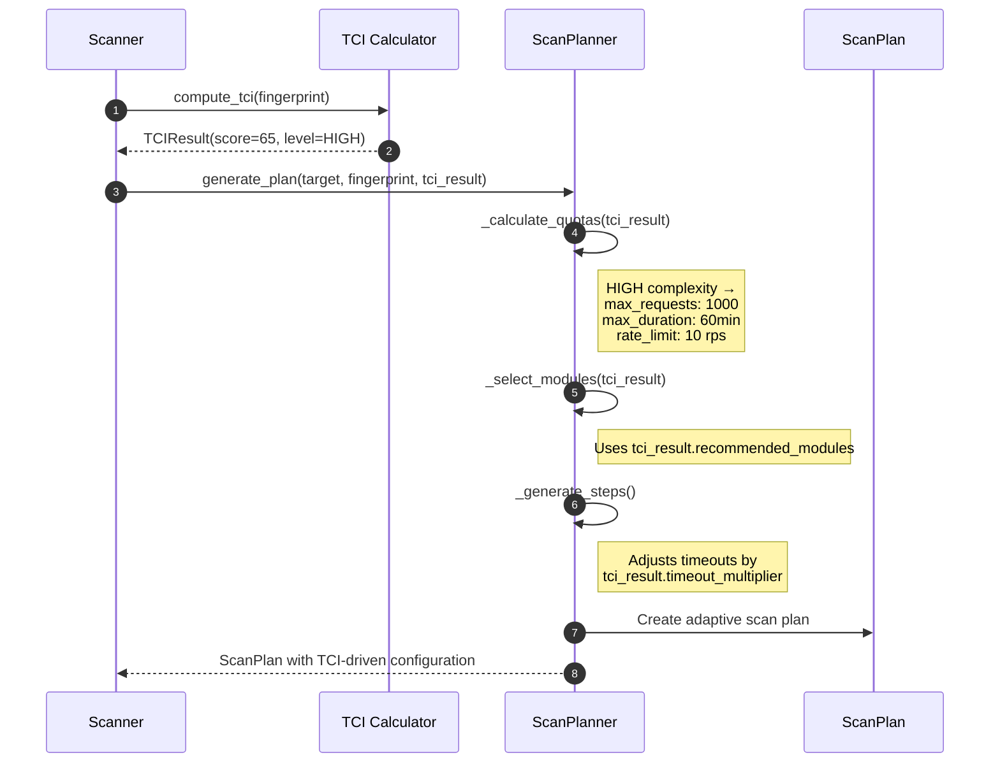

# Target Complexity Index (TCI) Calculation

This diagram illustrates the Target Complexity Index calculation system that enables adaptive, context-aware vulnerability scanning.

## Overview

The TCI system provides:
1. Multi-dimensional fingerprint analysis (25+ attributes)
2. Configurable weighted scoring (9 component dimensions)
3. Complexity level classification (minimal → critical)
4. Security posture assessment
5. Module recommendations and scan hints
6. Integration with the Adaptive Scan Planner

## Architecture



## Sequence Diagram: TCI Calculation Flow



## Sequence Diagram: Port and Service Analysis



## Sequence Diagram: Technology Stack Analysis



## Sequence Diagram: Authentication Complexity Analysis



## Sequence Diagram: Module Recommendations Generation



## Sequence Diagram: Security Posture Determination



## Sequence Diagram: Scan Hints Calculation



## Key Components

| Component | File Location | Responsibility |
|-----------|---------------|----------------|
| TCI Calculator | `strix/core/tci.py` | Main complexity calculation |
| TargetFingerprint | `strix/core/tci.py` | Target characteristic model |
| TCIConfig | `strix/core/tci.py` | Configurable weight settings |
| TCIResult | `strix/core/tci.py` | Calculation result with recommendations |
| compute_tci() | `strix/core/tci.py` | Convenience function |
| Scan Planner | `strix/agents/planner.py` | Consumes TCI for adaptive planning |

## Weight Configuration

| Component | Default Weight | Description |
|-----------|----------------|-------------|
| port_count_weight | 0.10 | Number of open ports |
| service_diversity_weight | 0.08 | Variety of services |
| high_risk_ports_weight | 0.12 | Dangerous ports (DBs, admin, etc.) |
| tech_stack_weight | 0.10 | Technology vulnerability richness |
| framework_count_weight | 0.05 | Number of frameworks |
| auth_complexity_weight | 0.15 | Authentication mechanism complexity |
| api_surface_weight | 0.12 | API endpoint count/complexity |
| graphql_weight | 0.05 | GraphQL presence |
| waf_cdn_weight | 0.08 | WAF/CDN evasion complexity |
| cloud_complexity_weight | 0.07 | Cloud infrastructure |
| data_sensitivity_weight | 0.08 | Data sensitivity indicators |

## Complexity Levels

| Level | Score Range | Characteristics |
|-------|-------------|-----------------|
| MINIMAL | 0-20 | Simple target, few attack vectors |
| LOW | 21-40 | Basic web app, limited API |
| MEDIUM | 41-60 | Standard enterprise app |
| HIGH | 61-80 | Complex stack, multiple auth, large API |
| CRITICAL | 81-100 | Highly complex, hardened, sensitive data |

## TCIResult Structure

```python
@dataclass
class TCIResult:
    # Overall score (0-100)
    score: float

    # Classification
    complexity_level: ComplexityLevel    # minimal → critical
    security_posture: SecurityPosture    # hardened, standard, permissive, unknown

    # Component scores (0-1 scale)
    port_score: float
    service_diversity_score: float
    high_risk_ports_score: float
    tech_stack_score: float
    auth_complexity_score: float
    api_surface_score: float
    waf_complexity_score: float
    data_sensitivity_score: float
    cloud_complexity_score: float

    # Recommendations
    recommended_modules: list[str]       # Up to 5 prompt modules
    priority_vulnerabilities: list[str]  # Up to 8 vuln types

    # Scan hints
    suggested_timeout_multiplier: float  # 1.0 - 3.0
    suggested_safe_mode: bool
    max_parallel_tests: int              # 1 - 10
```

## Integration with Scan Planner


