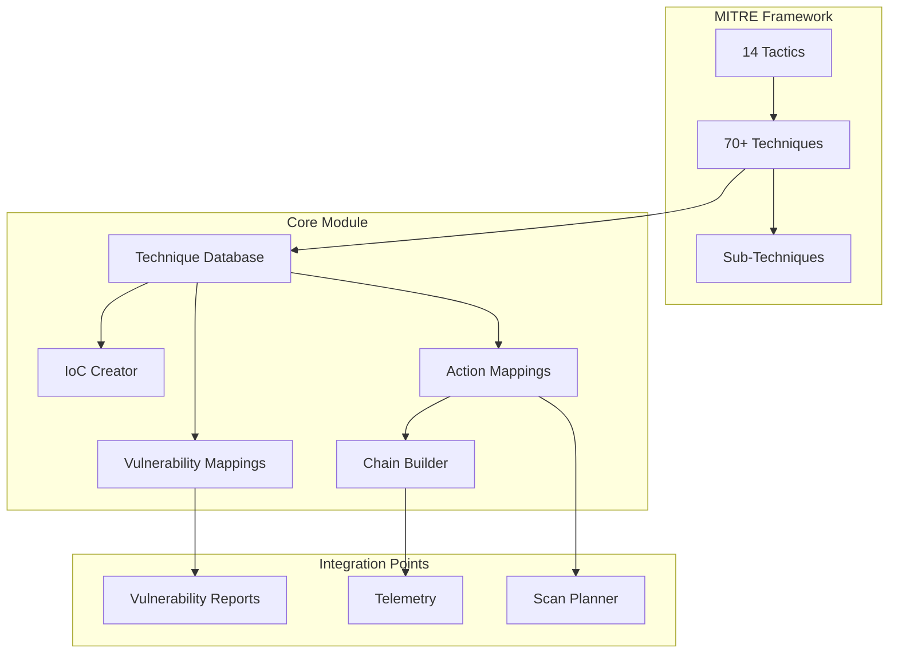
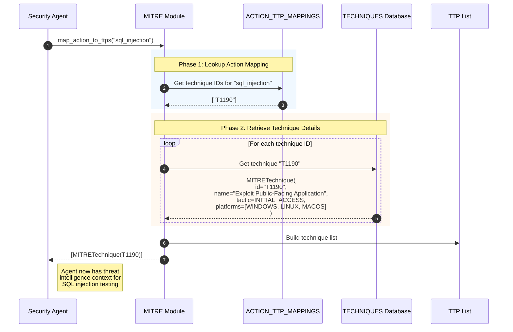
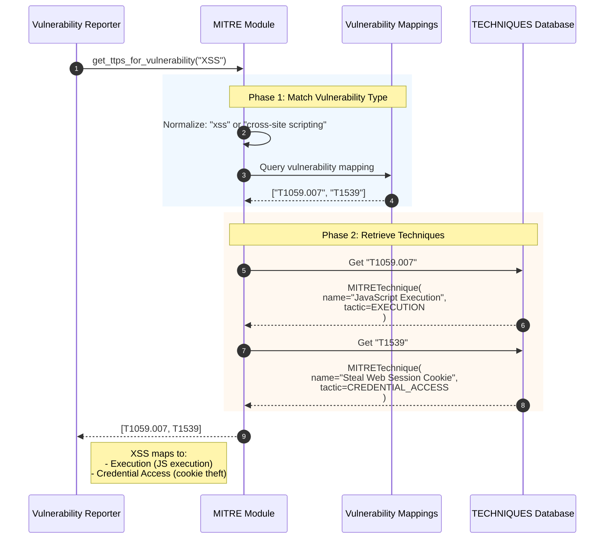
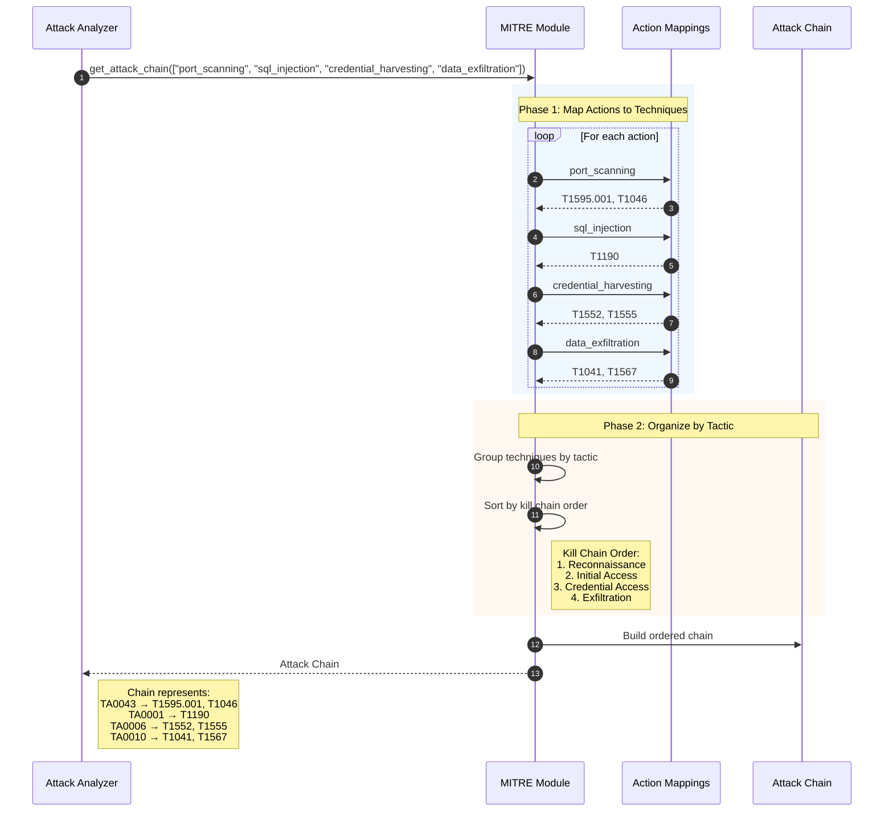
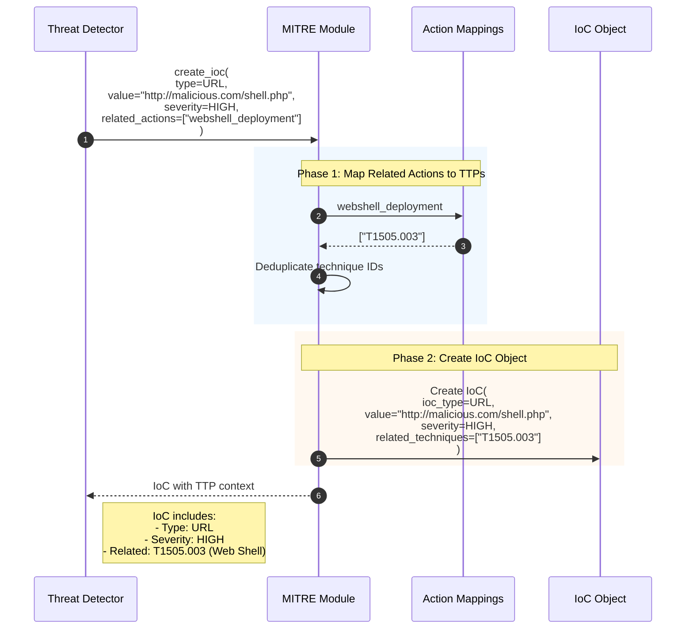
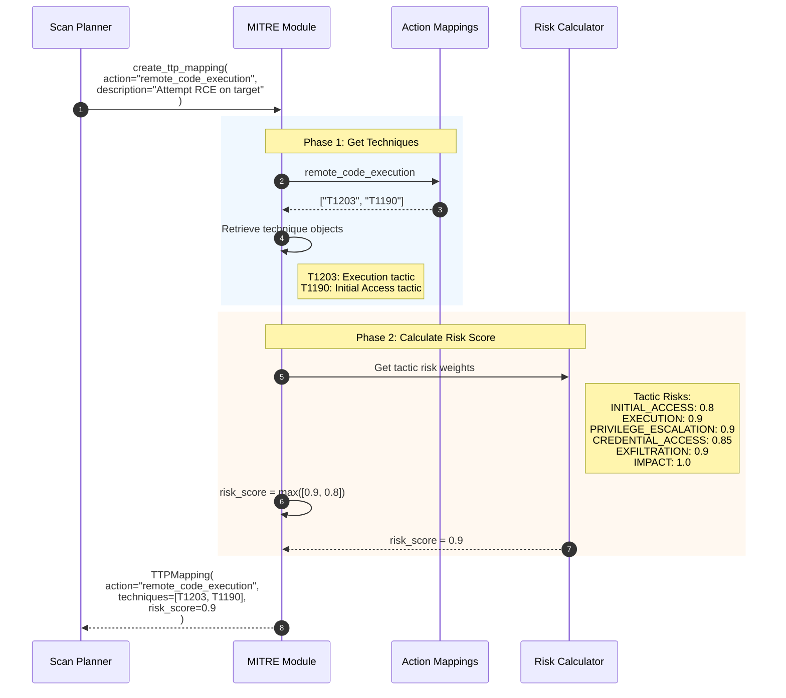
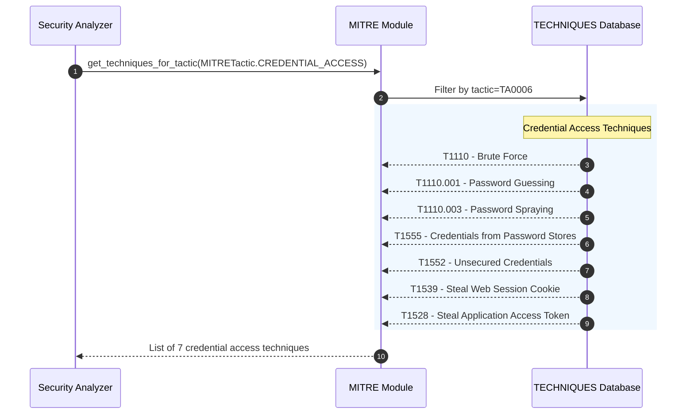
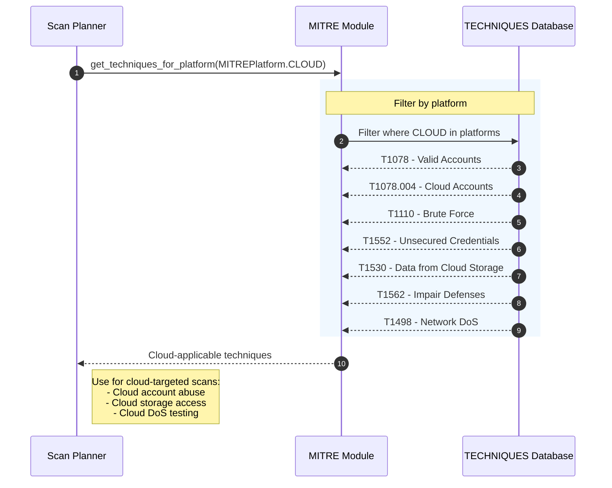
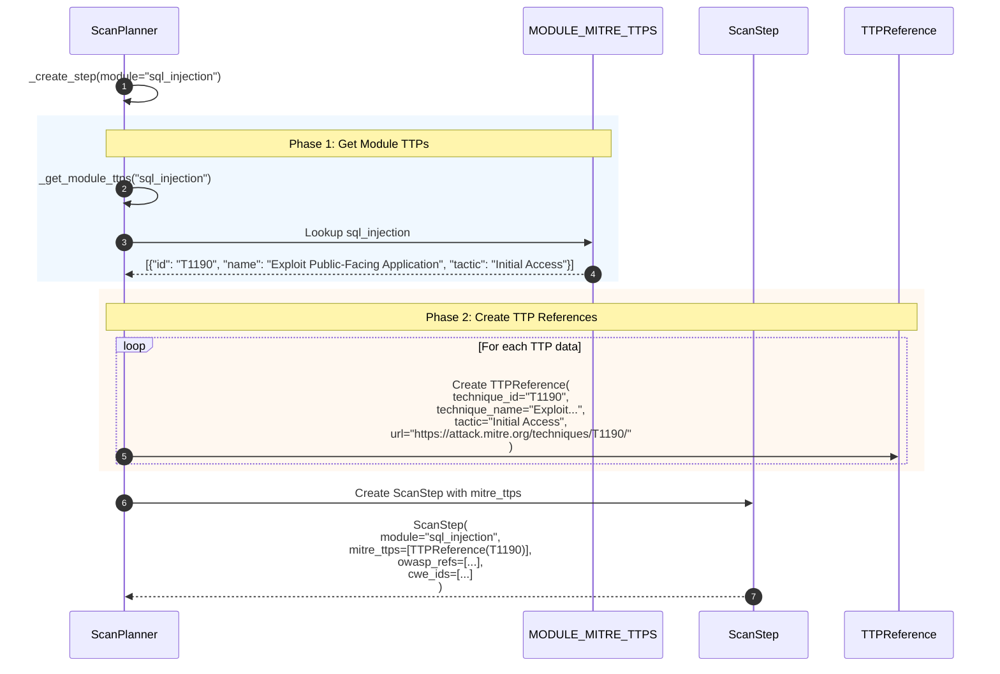

# MITRE ATT&CK Integration

This diagram illustrates how Strix integrates MITRE ATT&CK Tactics, Techniques, and Procedures (TTPs) for threat intelligence tagging and attack chain analysis.

## Overview

The MITRE ATT&CK integration provides:
1. Comprehensive technique database (70+ techniques across all tactics)
2. Action-to-TTP mapping for security testing operations
3. Attack chain construction from action sequences
4. Indicator of Compromise (IoC) classification
5. Risk scoring based on tactic criticality
6. Cross-references with OWASP categories

## Architecture



## Sequence Diagram: Action to TTP Mapping



## Sequence Diagram: Vulnerability to TTP Mapping



## Sequence Diagram: Attack Chain Construction



## Sequence Diagram: IoC Creation with TTP Mapping



## Sequence Diagram: TTP Mapping with Risk Scoring



## Sequence Diagram: Technique Retrieval by Tactic



## Sequence Diagram: Platform-Specific Technique Filtering



## Sequence Diagram: Scan Planner TTP Integration



## Key Components

| Component | File Location | Responsibility |
|-----------|---------------|----------------|
| MITRE Module | `strix/core/mitre.py` | Core TTP functionality |
| MITRETactic | `strix/core/mitre.py` | 14 ATT&CK tactics enum |
| MITRETechnique | `strix/core/mitre.py` | Technique data structure |
| TECHNIQUES | `strix/core/mitre.py` | 70+ technique database |
| ACTION_TTP_MAPPINGS | `strix/core/mitre.py` | Action-to-TTP lookup |
| IoC | `strix/core/mitre.py` | Indicator of Compromise |
| Scan Planner | `strix/agents/planner.py` | TTP-tagged scan steps |

## MITRE ATT&CK Tactics (Kill Chain Order)

| ID | Tactic | Description |
|----|--------|-------------|
| TA0043 | Reconnaissance | Information gathering about targets |
| TA0042 | Resource Development | Establishing resources for operations |
| TA0001 | Initial Access | Gaining initial foothold |
| TA0002 | Execution | Running malicious code |
| TA0003 | Persistence | Maintaining access |
| TA0004 | Privilege Escalation | Gaining higher permissions |
| TA0005 | Defense Evasion | Avoiding detection |
| TA0006 | Credential Access | Stealing credentials |
| TA0007 | Discovery | Learning about the environment |
| TA0008 | Lateral Movement | Moving through network |
| TA0009 | Collection | Gathering target data |
| TA0011 | Command and Control | Communicating with compromised systems |
| TA0010 | Exfiltration | Stealing data |
| TA0040 | Impact | Disrupting availability/integrity |

## Action to TTP Mappings

```
Security Testing Actions → MITRE Techniques:

Reconnaissance:
├── port_scanning → T1595.001, T1046
├── vulnerability_scanning → T1595.002
├── service_enumeration → T1046, T1592
├── directory_bruteforce → T1595, T1087
├── subdomain_enumeration → T1590, T1593
└── osint_gathering → T1589, T1593

Credential Attacks:
├── password_bruteforce → T1110.001
├── password_spraying → T1110.003
├── credential_stuffing → T1110.004
├── session_hijacking → T1539, T1528
└── jwt_attack → T1528, T1539

Web Application Attacks:
├── sql_injection → T1190
├── xss_attack → T1059.007, T1539
├── xxe_attack → T1190, T1005
├── ssrf_attack → T1190, T1046
├── csrf_attack → T1190
├── idor_attack → T1190, T1087
├── file_upload_attack → T1190, T1505.003
├── deserialization_attack → T1190, T1059
└── graphql_injection → T1190

Execution:
├── powershell_execution → T1059.001
├── cmd_execution → T1059.003
├── bash_execution → T1059.004
├── python_execution → T1059.006
└── remote_code_execution → T1203, T1190

Privilege Escalation:
├── privilege_escalation → T1068, T1548
├── uac_bypass → T1548.002
├── sudo_abuse → T1548.003
└── token_manipulation → T1134

Persistence:
├── webshell_deployment → T1505.003
├── account_creation → T1136
└── backdoor_installation → T1505, T1543

Exfiltration:
├── data_collection → T1005, T1213
├── cloud_data_access → T1530
└── data_exfiltration → T1041, T1567
```

## MITRETechnique Structure

```python
@dataclass
class MITRETechnique:
    technique_id: str                    # "T1059.001"
    name: str                            # "PowerShell"
    description: str                     # Full description
    tactic: MITRETactic                  # EXECUTION
    platforms: list[MITREPlatform]       # [WINDOWS]
    permissions_required: list[str]      # ["User"]
    data_sources: list[str]              # ["Command", "Process"]
    detection: str                       # Detection guidance
    mitigation: str                      # Mitigation guidance
    url: str                             # Auto-generated MITRE URL
    sub_techniques: list[str]            # Child technique IDs
    is_sub_technique: bool               # True if sub-technique
    parent_technique: str | None         # Parent ID if sub-technique
```

## IoC Structure

```python
@dataclass
class IoC:
    ioc_type: IoCType                    # IP_ADDRESS, DOMAIN, URL, etc.
    value: str                           # The indicator value
    severity: IoCSeverity                # critical, high, medium, low
    description: str                     # Context description
    related_techniques: list[str]        # MITRE technique IDs
    confidence: float                    # 0.0 - 1.0
    tags: list[str]                      # Custom tags
    source: str                          # Where IoC was found
    first_seen: str | None               # Timestamp
    last_seen: str | None                # Timestamp
```

## Risk Score Calculation

The risk score is calculated based on the highest-risk tactic associated with an action:

```python
TACTIC_RISKS = {
    MITRETactic.INITIAL_ACCESS: 0.8,
    MITRETactic.EXECUTION: 0.9,
    MITRETactic.PRIVILEGE_ESCALATION: 0.9,
    MITRETactic.CREDENTIAL_ACCESS: 0.85,
    MITRETactic.LATERAL_MOVEMENT: 0.8,
    MITRETactic.EXFILTRATION: 0.9,
    MITRETactic.IMPACT: 1.0,
}

# Other tactics default to 0.5
risk_score = max(tactic_risks.get(technique.tactic, 0.5) for technique in techniques)
```

## Integration with Scan Planner

Each scan step includes MITRE ATT&CK tagging:

```python
ScanStep(
    module="sql_injection",
    mitre_ttps=[
        TTPReference(
            technique_id="T1190",
            technique_name="Exploit Public-Facing Application",
            tactic="Initial Access",
            url="https://attack.mitre.org/techniques/T1190/"
        )
    ],
    owasp_refs=[...],
    cwe_ids=["CWE-89", "CWE-564"]
)
```

## Cross-Reference with OWASP

MITRE techniques are cross-referenced with OWASP categories through the `mitre_techniques` field in `OWASPCategory`:

```
OWASP A03:2025 (Injection) → MITRE Techniques:
├── T1190 - Exploit Public-Facing Application
├── T1059 - Command and Scripting Interpreter
└── T1059.007 - JavaScript

OWASP A01:2025 (Broken Access Control) → MITRE Techniques:
├── T1078 - Valid Accounts
├── T1087 - Account Discovery
└── T1134 - Access Token Manipulation
```
