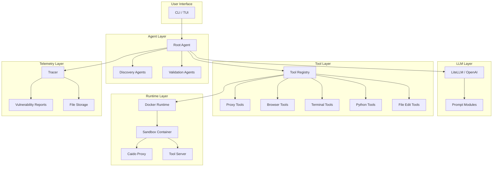

# Strix Logic & Architecture Documentation

This directory contains detailed Mermaid sequence diagrams documenting all major features and workflows in the Strix cybersecurity agent platform.

## Overview

Strix is an AI-powered autonomous penetration testing agent that conducts security assessments using a multi-agent architecture. These diagrams illustrate the internal logic and component interactions.

## Diagram Index

### Core Execution Flow

| # | Diagram | Description |
|---|---------|-------------|
| 01 | [Application Startup](01-application-startup.md) | CLI initialization, environment validation, Docker setup |
| 02 | [Root Agent Execution](02-root-agent-execution.md) | Main agent loop, LLM interactions, tool processing |
| 03 | [Sub-Agent Coordination](03-sub-agent-coordination.md) | Multi-agent spawning, parallel execution, message passing |
| 04 | [Tool Execution Pipeline](04-tool-execution-pipeline.md) | Tool invocation, validation, routing, and execution |

### Security Testing Workflows

| # | Diagram | Description |
|---|---------|-------------|
| 05 | [Vulnerability Discovery](05-vulnerability-discovery.md) | Discovery agents, validation, PoC creation, reporting |
| 06 | [HTTP Request Capture](06-http-request-capture.md) | Caido proxy integration, traffic analysis, replay |
| 08 | [White-Box Testing](08-white-box-testing.md) | Code analysis, static + dynamic testing, patching |
| 09 | [Black-Box Testing](09-black-box-testing.md) | External testing, fuzzing, automated scanning |

### Infrastructure & Support

| # | Diagram | Description |
|---|---------|-------------|
| 07 | [Inter-Agent Communication](07-inter-agent-communication.md) | Message queue, agent coordination patterns |
| 10 | [Sandbox Lifecycle](10-sandbox-lifecycle.md) | Docker container management, tool server |
| 11 | [LLM Prompt Construction](11-llm-prompt-construction.md) | Prompt building, module loading, response parsing |
| 12 | [Scan Result Persistence](12-scan-result-persistence.md) | Telemetry, vulnerability reports, output files |

## Architecture Overview

## Key Concepts

### Multi-Agent Architecture
- **Root Agent**: Orchestrates the scan, creates specialized sub-agents
- **Discovery Agents**: Test for specific vulnerability classes (SQLi, XSS, etc.)
- **Validation Agents**: Create proof-of-concept exploits for findings
- **Reporting Agents**: Document and format vulnerability reports

### Prompt Modules
Specialized knowledge injected into agent prompts:
- **Vulnerability Modules**: `sql_injection`, `xss`, `idor`, `ssrf`, etc.
- **Framework Modules**: `fastapi`, `nextjs`
- **Protocol Modules**: `graphql`
- **Technology Modules**: `firebase_firestore`, `supabase`

### Sandbox Environment
Isolated Docker container providing:
- HTTP proxy (Caido) for traffic interception
- Browser automation (Playwright)
- Shell command execution
- Python runtime
- File system access

### Tool Categories
| Category | Examples | Execution |
|----------|----------|-----------|
| Proxy | `list_requests`, `send_request` | Sandbox |
| Browser | `browser_action` | Sandbox |
| Terminal | `terminal_execute` | Sandbox |
| Python | `python_action` | Sandbox |
| File Edit | `str_replace_editor` | Sandbox |
| Agents | `create_agent`, `send_message_to_agent` | Host |
| Reporting | `create_vulnerability_report` | Host |

## Reading the Diagrams

All diagrams use Mermaid sequence diagram syntax. To view them:

1. **GitHub**: Renders automatically in the web interface
2. **VS Code**: Install "Mermaid Preview" extension
3. **CLI**: Use `mmdc` (Mermaid CLI) to render to images
4. **Online**: Paste into [mermaid.live](https://mermaid.live)

## Related Documentation

- [Prompting Guide](../prompting-guide.md) - How to write effective scan instructions
- [Scope Configuration](../scope-configuration.md) - Configuring target scope rules

## Contributing

When updating these diagrams:
1. Keep diagrams focused on specific workflows
2. Use consistent participant naming
3. Add phase annotations with `rect` blocks
4. Include component location tables
5. Test rendering before committing
